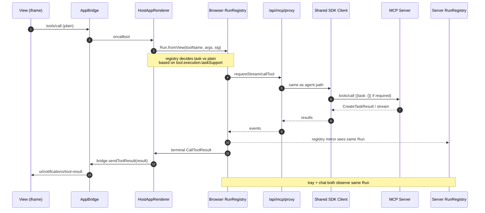
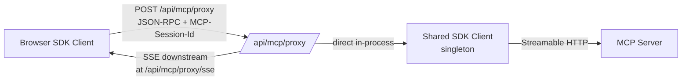
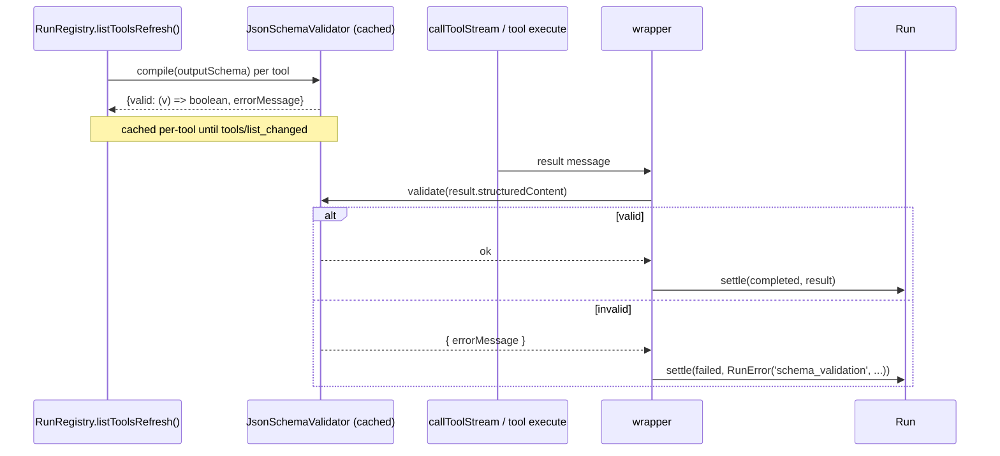
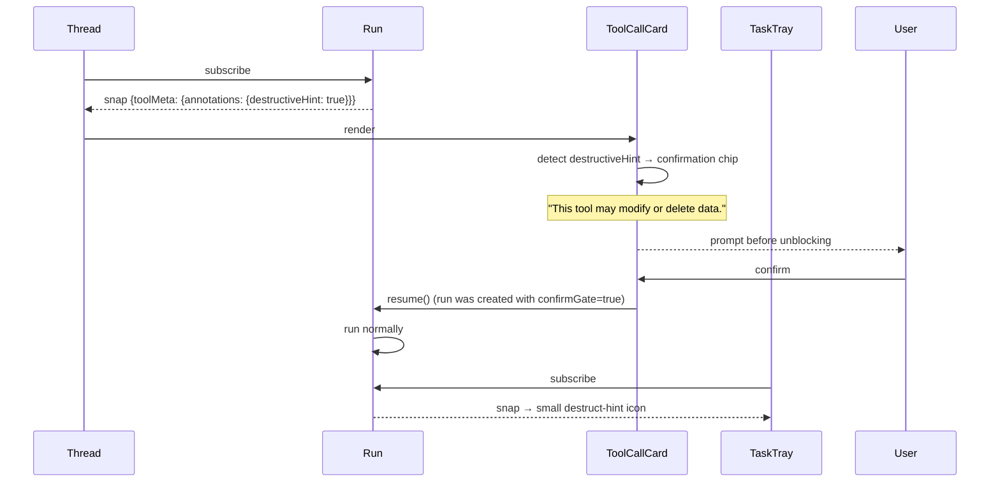
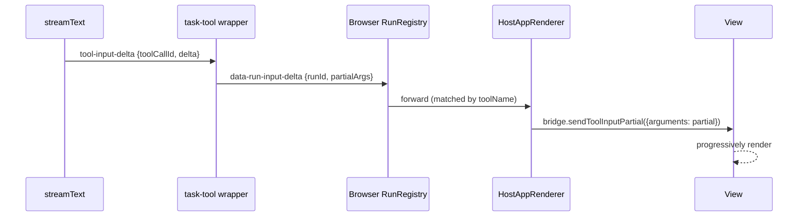
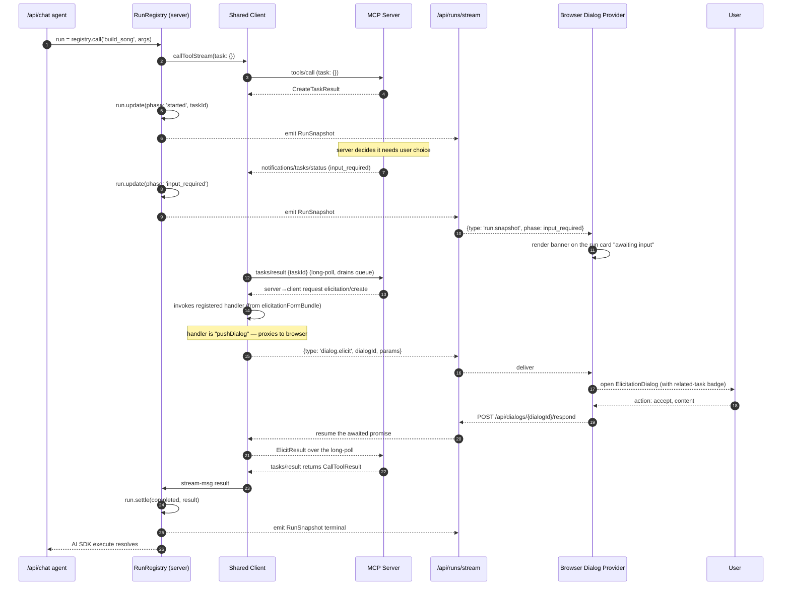
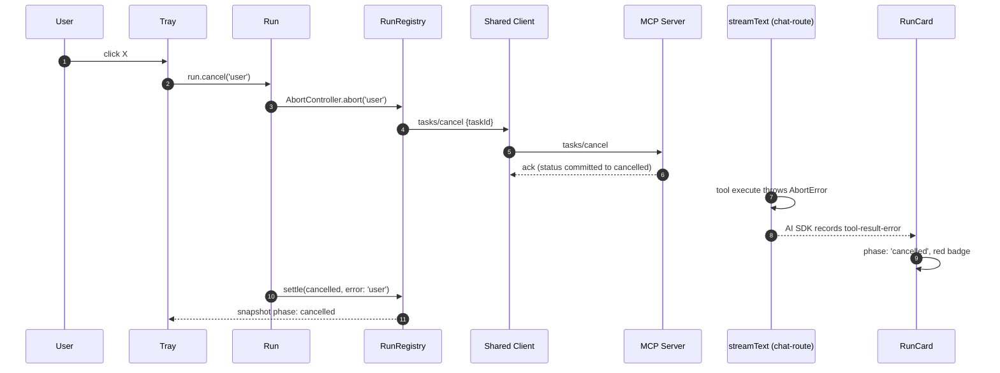
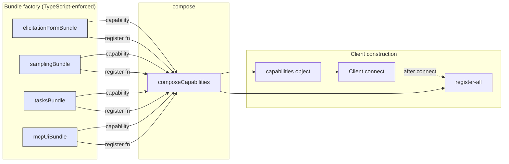
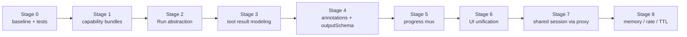
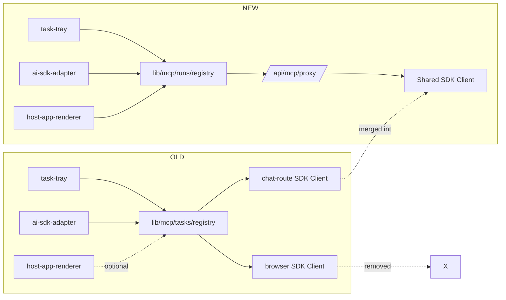

## Executive summary (≈200 words)

`audiostudio` runs two MCP `Client` instances against the same MCP server — one in the chat route (Node) and one in the browser — with different `sessionId`s. Tools, tasks, elicitation, sampling, MCP App Views, and the assistant-ui transcript are all glued together by ad-hoc wiring that handles the happy path but produces five categories of failure: (1) cross-registry blindness — agent-initiated tasks on the chat-route session are invisible to the browser tray; (2) MCP App Views can't call task-required tools because their `oncalltool` defaults to plain `tools/call`; (3) the chat-route advertises `elicitation`/`sampling`/`tasks.requests.*` capabilities but registers no handlers, violating the §"Capabilities" mutual contract; (4) `Tool.outputSchema` is ignored, `structuredContent`/`isError` are not surfaced semantically to the model, and tool annotations get stripped by the `dynamicTool` wrapper; (5) the UI splits one logical operation across three disconnected surfaces (assistant-ui card, `data-task-progress` rows, TaskTray).

The proposed architecture collapses the two browser and server MCP clients into a single canonical session via a server-proxied transport so there is exactly one `sessionId`. It introduces a `Run` abstraction for every tool call, a registry-driven `CapabilityBundle` factory that prevents capability advertisement without a handler, and a unified Run-Surface React layer that drives both inline message rendering and the persistent tray from one observable.

What follows is the full report.

---

# MCP Architecture Deep Research — `audiostudio`
*A spec-by-spec audit and proposed unified Run-centric architecture*

> Note on output medium: my READ-ONLY system prompt forbids file creation, including under `.omc/`. The report is delivered inline below. Every line is intended to be readable as a single Markdown document.

---

## Table of contents

1. [§1 — Spec inventory](#1--spec-inventory)
2. [§2 — Current implementation map](#2--current-implementation-map)
3. [§3 — Architectural problem statement](#3--architectural-problem-statement)
4. [§4 — Proposed architecture](#4--proposed-architecture)
5. [§5 — Migration plan](#5--migration-plan)
6. [§6 — Schemas](#6--schemas)
7. [§7 — Decision matrix](#7--decision-matrix)
8. [§8 — Open questions](#8--open-questions)

---

## §1 — Spec inventory

This section walks every MCP feature touching tools and tasks. Each subsection: a one-paragraph summary, the canonical spec quote (or its SDK schema as authoritative substitute when the prose at modelcontextprotocol.io is silent), and the SDK type/file:line.

### §1.1 — Lifecycle and capability negotiation

**Summary.** Every MCP session opens with `initialize` (request) → `InitializeResult` (response) → `notifications/initialized` (notification). Both peers declare a capabilities object. Capabilities are a *mutual contract*: each peer MUST honour every capability it advertises, and MAY refuse to invoke a remote method whose capability the peer did not advertise. SDK-level enforcement is gated by the `enforceStrictCapabilities` option and the `assertCapabilityForMethod` / `assertRequestHandlerCapability` / `assertTaskCapability` / `assertTaskHandlerCapability` family.

**SDK enforcement.** `node_modules/@modelcontextprotocol/sdk/dist/esm/client/index.js:347-453` — distinct guards for outgoing requests, incoming requests, outgoing notifications, and task-augmented requests. Note specifically `:415-438`:

> ```js
> case 'sampling/createMessage':
>     if (!this._capabilities.sampling) {
>         throw new Error(`Client does not support sampling capability (required for ${method})`);
>     }
> ...
> case 'tasks/get':
> case 'tasks/list':
> case 'tasks/result':
> case 'tasks/cancel':
>     if (!this._capabilities.tasks) {
>         throw new Error(`Client does not support tasks capability (required for ${method})`);
>     }
> ```

**Capability shape (Client).** `types.d.ts:2350-2410` (`ClientCapabilitiesSchema`) and `:516-545` (`TasksClientCapabilitiesSchema`):

```text
ClientCapabilities = {
  experimental?: object,
  roots?: { listChanged?: boolean },
  sampling?: object,                       // §1.5
  elicitation?: { form?: {...}, url?: {...} }, // §1.4
  tasks?: {                                // §1.3
    list?: object,
    cancel?: object,
    requests?: {
      sampling?:    { createMessage?: object },
      elicitation?: { create?:        object },
    },
  },
  extensions?: Record<string, object>,    // §1.6 (SEP-1865)
}
```

**Capability shape (Server).** `types.d.ts:546-606`:

```text
ServerCapabilities = {
  experimental?: object,
  logging?: object,
  prompts?: { listChanged?: boolean },
  resources?: { subscribe?: boolean, listChanged?: boolean },
  tools?:     { listChanged?: boolean },
  completions?: object,
  tasks?: {
    list?: object,
    cancel?: object,
    requests?: {
      tools?: { call?: object },
      sampling?: { createMessage?: object },
      elicitation?: { create?: object },
    },
  },
  extensions?: Record<string, object>,
}
```

**Failure mode.** With `enforceStrictCapabilities: true`, the SDK throws synchronously *before* the request hits the wire. Without it, the server may return JSON-RPC `-32601 Method not found` (a strict server) or accept silently (a permissive one). A peer that advertises a capability and then *fails to register a handler* gets the worst of both: the SDK lets the request enter and the handler dispatch returns `MethodNotFound` after the round-trip — a debuggability nightmare and a spec violation of "a peer MUST honour everything it advertises."

### §1.2 — Tools

**Declaration.** `types.d.ts:2381-2419` (`ToolSchema`) — every tool has at minimum `{ name }`, plus optional `description`, `title`, `inputSchema` (JSON-Schema), `outputSchema` (JSON-Schema), `annotations` (`ToolAnnotations`), `execution` (`ToolExecution`, see §1.3), `_meta`, and `icons[]`.

**Listing.** `tools/list` — paginated via `cursor`/`nextCursor`. Servers MAY emit `notifications/tools/list_changed` to invalidate the client's cache; clients SHOULD listen and refetch. SDK auto-handles this if the client passes `listChanged.tools.onChanged` at construction time (`client/index.js:_setupListChangedHandler` at `:575-650`). Without that option, the notification is silently dropped.

**Calling.** `tools/call` returns a `CallToolResult`:

```text
CallToolResult {
  content: ContentBlock[],         // text | image | audio | resource_link | embedded_resource
  structuredContent?: any,         // SHOULD match Tool.outputSchema if declared
  isError?: boolean,               // true => content is an error message intended for the model
  _meta?: { ... },
}
```

`types.d.ts:2501-2620` — the `content` default is `[]` and `isError` default is `false`.

**Output-schema validation.** When a tool advertises `outputSchema`, the spec says the server MUST return `structuredContent` (unless `isError: true`); clients MUST validate against the schema. SDK enforces this in *two* places — once for plain `callTool` (`client/index.js:498-519`) and once inside `callToolStream` (`experimental/tasks/client.js:75-110`):

> ```js
> if (!result.structuredContent && !result.isError) {
>     yield { type: 'error', error: new McpError(ErrorCode.InvalidRequest,
>         `Tool ${params.name} has an output schema but did not return structured content`) };
>     return;
> }
> ```

**Annotations as hints.** `types.d.ts:2354-2367`:

> NOTE: all properties in `ToolAnnotations` are **hints**. They are not guaranteed to provide a faithful description of tool behavior (including descriptive properties like `title`). Clients should never make tool use decisions based on `ToolAnnotations` received from untrusted servers.

This is a *permission*, not a prohibition: hosts SHOULD use `destructiveHint` etc. to drive UX (e.g., a "this is destructive — confirm?" gate) but MUST NOT use them as security decisions.

**Icons.** `types.d.ts:2408-2416` — each entry is `{ src, mimeType?, sizes?, theme? }`. Display-only; render alongside the tool name.

**`_meta`.** Free-form. SEP-1865 hangs `ui.resourceUri` and `ui.visibility` here. The MCP base spec reserves the prefix `io.modelcontextprotocol/*` and warns implementers against squatting it.

### §1.3 — Tasks

**Status enum.** `types.d.ts:1026-1032`:

```text
TaskStatus = 'working' | 'input_required' | 'completed' | 'failed' | 'cancelled'
```

Note that the spec status enum has *no* `'pending'`. Our `TaskHandle` adds a local `'pending'` only as a pre-`taskCreated` marker — see `lib/mcp/tasks/handle.ts:42-48`. This is reasonable but should be flagged as host-side-only.

**Task schema.** `types.d.ts:1036-1050`:

```text
Task {
  taskId: string,
  status: TaskStatus,
  ttl: number | null,         // ms remaining; null means no TTL
  createdAt: string,          // ISO8601
  lastUpdatedAt: string,
  pollInterval?: number,      // ms; server's preferred poll cadence
  statusMessage?: string,
}
```

**Lifecycle.** A request that opts into the task path (the request includes a `params.task` object) follows: client sends the request → server creates a task → server returns `CreateTaskResult` with the initial `Task` object → client polls `tasks/get` until terminal OR the task hits `input_required` → on `input_required` the client calls `tasks/result` (which long-polls and *also* drains queued elicitation/sampling requests delivered as side-channel messages) → on `completed` the client calls `tasks/result` to fetch the actual result.

**`tasks/get`.** `types.d.ts:1149-1196`. Returns the live `Task` object. No payload.

**`tasks/result`.** `types.d.ts:1200-1241`. Returns the typed result of the *original* request (e.g., `CallToolResult` for a `tools/call` task). Long-polling: blocks until terminal-or-timeout, AND on `input_required` returns a special envelope through which the SDK pushes `elicitation/create` and `sampling/createMessage` server→client requests over the same HTTP response stream.

**Critical mechanic — the input_required race.** Read `node_modules/@modelcontextprotocol/sdk/dist/esm/shared/protocol.js:586-591`:

> ```js
> // When input_required, call tasks/result to deliver queued messages
> // (elicitation, sampling) via SSE and block until terminal
> if (task.status === 'input_required') {
>     const result = await this.getTaskResult({ taskId }, resultSchema, options);
>     yield { type: 'result', result };
>     return;
> }
> ```

The SDK detects `input_required`, swaps polling for a single blocking `tasks/result` call that drains queued server-initiated requests, and yields the eventual `result` directly. This is also why our `TaskHandleImpl` correctly distinguishes `update()` (UI-only push notification) from `settle()` (terminal authority): a status notification can mark a task `completed` *before* `tasks/result` returns the payload, and conflating them produces a "completed but no payload" race that we already documented in `lib/mcp/tasks/handle.ts:9-23`.

**`tasks/list`.** `types.d.ts:1245-1295`. Server-wide enumeration with pagination. The spec implies this returns "tasks visible to this client/session"; our reattach loop in `registry.ts:299-313` iterates all returned tasks, which currently behaves correctly because we have only one server but is *not* spec-bounded — gap #9 in the brief.

**`tasks/cancel`.** `types.d.ts:1299-1316`. The server commits the transition to `cancelled` synchronously (rule 2 — "the boundary transitions to `cancelled` before responding"), so subsequent push notifications and `tasks/result` see `cancelled`. Our `TaskHandleImpl.cancel()` flips local state pre-roundtrip (`handle.ts:135-153`) which is spec-friendly.

**`notifications/tasks/status`.** `types.d.ts:1116-1145`:

```text
TaskStatusNotification {
  method: 'notifications/tasks/status',
  params: TaskStatusNotificationParams = Task & {
    _meta?: { progressToken?, 'io.modelcontextprotocol/related-task'? },
  }
}
```

Push-only — UI metadata, no payload. Our registry installs a single handler at `registry.ts:95-117`.

**TTL.** `Task.ttl` is `number | null`. If `null`, no TTL applies. If a number, it represents the remaining lifetime; the server SHOULD garbage-collect the task afterward. We have *no* TTL handling — gap #10. A surfaced warning should fire at e.g. 80% of TTL.

**Tool-level task negotiation.** `types.d.ts:2371-2406` (`ToolExecutionSchema`):

```text
Tool.execution.taskSupport ∈ { 'optional' | 'required' | 'forbidden' | undefined }
```

Semantics (per spec / SDK behavior at `client/index.js:490-558`):

| `taskSupport` | client `callTool` | client `callToolStream` (i.e., `task: {}`) |
|---|---|---|
| `undefined` or absent | OK (plain) | OK; SDK sets `task: undefined`, falls through to plain |
| `'optional'` | OK (plain) | OK; SDK auto-sets `task: {}` and runs the task path |
| `'required'` | **rejected by SDK** with `InvalidRequest` ("requires task-based execution") | OK; required path |
| `'forbidden'` | OK (plain) | server SHOULD reject; SDK MAY hide the task option |

The SDK pre-caches the required/known sets in `cacheToolMetadata` (`:539-558`), called from `listTools()`. This is why our task-aware tool wrapper is necessary: `@ai-sdk/mcp` calls `callTool` directly (`@ai-sdk/mcp/dist/index.mjs:1947-1958`), which the SDK auto-rejects for `taskSupport: 'required'` tools.

### §1.4 — Elicitation

**Capability advertisement.** Client capabilities `elicitation` is an object that MAY contain `form: { applyDefaults?: boolean }` and `url: object`. Presence of either signals support. Pure `{}` (which we declare today) means "I support elicitation but neither mode explicitly opted-in." The SDK's `getSupportedElicitationModes` (`client/index.js:60-79`) treats this as supporting *neither* mode, which means servers SHOULD only attempt URL or form when their capability flag is opt-in. Our advertisement at `mcp-client-provider.tsx:251` and `app/api/chat/route.ts:151-152` should be tightened to `elicitation: { form: {} }` since we only handle form mode.

**Schema (request).** `types.d.ts:5091-5213` — discriminated union of form vs. URL mode. Form mode params:

```text
ElicitRequestFormParams {
  message: string,
  requestedSchema: JSONSchema (object), // primitive props only — string/number/boolean/array-of-string
  _meta?: { 'io.modelcontextprotocol/related-task'?: { taskId } }
}
```

URL mode is server-defined redirect-back, out of scope today (gap to flag).

**Schema (result).** `types.d.ts:5381+`:

```text
ElicitResult = { action: 'accept', content: Record<string, primitive | string[]> }
             | { action: 'decline' }
             | { action: 'cancel' }
```

Three actions, distinct semantics: `decline` = user said no; `cancel` = interrupted (Esc, page nav, modal dismiss). Servers MAY treat them differently. We comply with this distinction at `elicitation-dialog.tsx:113-117`.

**`_meta.io.modelcontextprotocol/related-task`.** `types.d.ts:6` defines `RELATED_TASK_META_KEY = 'io.modelcontextprotocol/related-task'`. When elicitation arrives *inside* a task, this `_meta` carries `{ taskId }`. Our dialog reads it for display (`elicitation-dialog.tsx:142-143`).

### §1.5 — Sampling

**Capability advertisement.** Client `sampling` is an object. Bare `{}` means "I support sampling." That's the entire negotiation.

**Request shape.** `types.d.ts:3580-3950` (`CreateMessageRequestParamsSchema`):

```text
CreateMessageRequestParams {
  messages: SamplingMessage[]            // each has role + content (block-or-array)
  modelPreferences?: ModelPreferences,
  systemPrompt?: string,
  includeContext?: 'none' | 'thisServer' | 'allServers',
  temperature?: number,
  maxTokens: number,                     // REQUIRED
  stopSequences?: string[],
  metadata?: any,
  tools?: Tool[],                        // 2025-11 expansion (CreateMessageWithTools)
  toolChoice?: ...
}
```

`ModelPreferences` (`types.d.ts:2991+`) carries `hints: [{name}]`, `costPriority`, `speedPriority`, `intelligencePriority`. Our `app/api/sample/route.ts:21-24` honors hints only as a hint (correct per spec — "MAY use … not MUST").

**Response.** `types.d.ts:4317+`:

```text
CreateMessageResult {
  model: string,                          // REQUIRED — name of the model used
  role: 'user' | 'assistant',
  content: ContentBlock,                  // single block (text typical)
  stopReason?: 'maxTokens'|'endTurn'|'stopSequence'| string,
  _meta?: ...
}
```

**Consent model.** Spec §"Sampling" requires the host to "obtain user consent before invoking the LLM." Our `sampling-approval-dialog.tsx` is the consent surface. Spec is silent on whether decline yields `-32000` or another code; our `SamplingDeclinedError` (`sampling-approval-dialog.tsx:57-63`) chooses `-32000` which is in the JSON-RPC server-defined-error range, fine.

### §1.6 — MCP Apps (SEP-1865)

**Capability negotiation.** Hosts advertise extension `io.modelcontextprotocol/ui` with mime types they accept; servers acknowledge in the same key on `ServerCapabilities.extensions`. Our provider does this via `UI_EXTENSION_CAPABILITIES` from `@mcp-ui/client` (`mcp-client-provider.tsx:242`).

**Tool linkage.** A tool may carry `_meta.ui.resourceUri = 'ui://...'`. The host treats that tool as "App-eligible": when called, the tool result triggers an iframe render of the named UI resource. `ui.visibility` is `['model']`, `['app']`, or both — `['app']`-only tools MUST NOT be exposed to the agent (we filter at `app/api/chat/route.ts:330-341`).

**View ↔ Host channel.** `AppBridge` (`@modelcontextprotocol/ext-apps`) is a `Protocol` subclass that runs the host side over `postMessage`. View calls go: View → AppBridge → host code (which usually proxies to the upstream MCP `Client`).

**View capability restrictions.** `ext-apps/src/app-bridge.js`:

> `assertTaskCapability(X){throw Error("Tasks are not supported in MCP Apps")}`
> `assertTaskHandlerCapability(X){throw Error("Task handlers are not supported in MCP Apps")}`

Views CANNOT initiate task-augmented requests. They send plain `tools/call`. *The host* must upgrade the call when the underlying tool advertises `taskSupport: 'required'`. Today our `host-app-renderer.tsx:442-451` does this — only after `viewInitialized` flips and only by overwriting `b.oncalltool`. There's a documented Radix-style "warn if request handler replaced" log emitted once per mount (acceptable but noisy).

**`ui/notifications/tool-input-partial`.** Streaming partial JSON of the tool's incoming arguments (host → view). Lets a View render an in-progress card before the agent finishes producing the call. Today we forward only the final `toolInput`/`toolResult` (`host-app-renderer.tsx:545-553`) — the streaming-partial path is wired via `bridge.sendToolInputPartial()` but no caller produces partials yet — gap #7.

**`ui/notifications/tool-result`.** Final `CallToolResult` delivered to the view post-execution. SEP-1865 requires it AFTER `tool-input` and only "if the View is still displayed."

### §1.7 — Progress (base MCP, non-task)

**Mechanism.** `_meta.progressToken` on a request → server emits zero-or-more `notifications/progress` with that token. SDK auto-installs the `progressToken` from the `onprogress` option (`shared/protocol.js:643-651`). Independent of tasks: servers MAY send progress against any request, not only task requests.

**Schema.** `notifications/progress` params: `{ progressToken: string|number, progress: number, total?: number, message?: string }`.

**Capability requirement.** None — `assertNotificationCapability` lists `notifications/progress` as "always allowed" (`client/index.js:404-406`). So progress is the ambient backchannel; tasks are the structured one.

**Our usage.** Zero. We pass `resetTimeoutOnProgress: true` to the SDK so a healthy task stays alive (registry.ts:368-370), but we never *consume* a progress event for plain (non-task) tools — gap #5. The SDK simply discards them when no `onprogress` is set.

### §1.8 — Cancellation

**Base MCP cancellation.** `notifications/cancelled` carries `{ requestId, reason? }`. Either side MAY send it; the receiver SHOULD abort. SDK fires this automatically when an `AbortSignal` aborts (`shared/protocol.js:670-687`).

**Task cancellation.** `tasks/cancel { taskId }` is a *request*, not a notification, so it has a result. Returns synchronously after the server commits the transition. Distinct from the request-level `notifications/cancelled` — task cancel applies to the entire task lifecycle, request cancel applies to the in-flight HTTP message.

### §1.9 — Streamable HTTP transport and session management

**Session-id mechanics.** Server sets `MCP-Session-Id` response header on `initialize`. Client echoes on subsequent POSTs. CORS: server MUST `Access-Control-Expose-Headers: MCP-Session-Id` for browsers. Our diagnostic fetch wrapper logs whether it is exposed (`mcp-client-provider.tsx:192-209`).

**Per-session isolation.** Tasks created in session A are visible to session A; another session SHOULD NOT see them via `tasks/list`. This is the spec's basis for "the user's browser tray can't see tasks created on the chat-route's session" — *because the two clients have different sessionIds*. The brief calls this gap #18.

**Session lifetime.** Server-defined. Our browser persists `sessionId` in `sessionStorage` so a refresh reattaches; the chat-route is process-scoped. There's no protocol-level "logout" — clients drop a session by closing the transport without reusing the id.

### §1.10 — Capability matrix (master)

| Capability | Server advertises | Client advertises | Methods that DEPEND on advertisement | Failure when missing |
|---|---|---|---|---|
| `tools` | yes | n/a | `tools/list`, `tools/call`, `notifications/tools/list_changed` | server: `-32601`; SDK throws on assert |
| `tools.listChanged` | optional flag | n/a | server emits `tools/list_changed` | client never refetches |
| `resources` | yes | n/a | `resources/list`, `resources/read`, `resources/templates/list`, `resources/subscribe` (gated by `resources.subscribe`) | server: `-32601` |
| `resources.subscribe` | flag | n/a | `resources/subscribe`, `resources/unsubscribe`, `notifications/resources/updated` | server rejects subscribe |
| `prompts` | yes | n/a | `prompts/list`, `prompts/get`, `notifications/prompts/list_changed` | client refrains; ours guards by reading `serverCapabilities?.prompts` |
| `completions` | yes | n/a | `completion/complete` | client refrains |
| `logging` | yes | n/a | `logging/setLevel`, `notifications/message` | n/a; we listen unconditionally — spec-permissive |
| `tasks` (server) | object | n/a | required for task-augmented requests when `taskSupport: 'required'`; otherwise enables `optional` upgrades | client falls back to plain |
| `tasks.list` (server) | flag | n/a | `tasks/list` | not enumerable |
| `tasks.cancel` (server) | flag | n/a | `tasks/cancel` | cancel ignored |
| `tasks.requests.tools.call` (server) | flag | n/a | accepts `task: {}` on `tools/call` | server rejects auto-upgrade |
| `tasks.requests.elicitation.create` (server) | flag | n/a | server may issue `elicitation/create` mid-task | server can't elicit mid-task |
| `tasks.requests.sampling.createMessage` (server) | flag | n/a | server may issue `sampling/createMessage` mid-task | server can't sample mid-task |
| `tasks` (client) | n/a | object | client may call `tasks/get`/list/result/cancel | SDK throws on assert |
| `tasks.requests.elicitation.create` (client) | n/a | flag | client may receive elicitation mid-task | server suppresses elicitation drain |
| `tasks.requests.sampling.createMessage` (client) | n/a | flag | as above for sampling | as above |
| `elicitation` (client) | n/a | object (form / url) | client SHOULD handle `elicitation/create` | SDK throws |
| `sampling` (client) | n/a | object | client SHOULD handle `sampling/createMessage` | SDK throws |
| `roots` (client) | n/a | object (`listChanged` flag) | server may call `roots/list`; client emits list_changed | n/a |
| `extensions["io.modelcontextprotocol/ui"]` (both) | mimeTypes | mimeTypes | host may render UI resources from this server; SEP-1865 §"Client-Server Negotiation" | server SHOULD NOT publish `ui://` resources |

The crucial property of this matrix: **every "advertised" entry in column 2 or 3 is a promise that must be paired with a live handler**. Today, our chat-route advertises `tasks.requests.elicitation.create`, `tasks.requests.sampling.createMessage`, `elicitation`, and `sampling` (`route.ts:140-153`) but registers *zero* `setRequestHandler` for any of them. Spec breach.

---

## §2 — Current implementation map

### §2.1 — `lib/mcp/tasks/handle.ts`

**What it does.** Defines `TaskSnapshot` (immutable shape) and `TaskHandle` (interface) plus `TaskHandleImpl` (the in-memory state machine). The split `update()` (UI-only) vs `settle()` (terminal authority) is documented at `:9-23` and is *correct* — it solves the input_required race described in §1.3.

**Spec sections implemented.** §1.3 (Tasks lifecycle, status enum). §1.8 (cancellation flips local state pre-roundtrip).

**Deviations.** Adds host-only `'pending'` status (`:42-48`). This is fine but needs a comment that this status never leaves the host.

**Code references.** `:39-48` (status enum); `:57-66` (snapshot); `:86-235` (impl); `:122-153` (`waitForResult` and `cancel`); `:165-235` (`update`/`settle`).

### §2.2 — `lib/mcp/tasks/registry.ts`

**What it does.** Owns the single `notifications/tasks/status` handler on a `Client` (`:95-117`), translates `callToolStream` messages to handle updates (`:341-441`), exposes `attach()` for in-flight resumption (`:216-271`), tracks task-support metadata (`:129-138`).

**Spec sections implemented.** §1.3 fully (Tasks). §1.8 partially (cancellation). §1.9 partially (session reattach via sessionId pinning is in `mcp-client-provider.tsx`, not here).

**Deviations.**
- `attach()` toolName is `(attached)` placeholder (`:223`) — task list returns no tool name, so we can't recover it without a server-side `task.toolName` extension. Acceptable but ugly.
- `dispose()` cancels every non-terminal handle (`:315-337`) but doesn't `removeNotificationHandler` (acknowledged TODO at `:332-336`). Innocuous in practice because Client teardown drops handlers.
- No memory pruning. Terminal handles linger forever in `_handles` (gap #19).
- No global ceiling / rate limit (gap #20).
- `listServerTasks` returns *all* tasks server-wide; `reattachInFlight` adopts every non-terminal one (`:299-313`) — see gap #9 (filter to ones we created).

### §2.3 — `lib/mcp/tasks/ai-sdk-adapter.ts`

**What it does.** `wrapToolSetWithTasks` overlays AI SDK tools with task-aware versions when the underlying MCP tool advertises `taskSupport !== 'forbidden'` (`:65-100`). Each wrapped tool subscribes to its `TaskHandle` and writes `data-task-progress` parts to the UI message stream (`:102-169`).

**Spec sections implemented.** §1.2 (tool calling), §1.3 (auto-upgrade to task path).

**Deviations.**
- **Ignores `outputSchema`** (`:111-167`) — passes raw `inputSchema` only into `jsonSchema(...)`. Tools with outputs aren't validated. Gap #3.
- **Drops annotations** — the `dynamicTool({...})` call at `:108-167` includes `description` and `inputSchema` but not `title`, `annotations.*`, or `icons`. Gap #6.
- **Returns raw `CallToolResult`** at `:158`. The `dynamicTool` `toModelOutput` is unset, so AI SDK falls back to JSON-stringifying the entire result, which is what `@ai-sdk/mcp` warns against (its own helper `mcpToModelOutput` is referenced at `@ai-sdk/mcp/dist/index.mjs:1605-1628` and converts `content[]` to AI SDK content blocks). Gap #4.
- **`isError: true` does NOT throw.** A tool that returns `isError: true` is the spec's way of saying "the call ran but the result is an error message intended for the model." Today we resolve normally and the model sees the JSON object — the agent likely ignores the `isError` flag and treats the body as truth.

### §2.4 — `components/mcp/tasks/context.tsx`

**What it does.** React provider that builds a `TaskRegistry` per `Client`, seeds the task-support map from `listTools()`, reattaches in-flight tasks on mount, and refreshes the support map on `tools/list_changed` (`:43-156`).

**Spec sections implemented.** §1.1 (lifecycle wiring), §1.3 (registry binding).

**Deviations.**
- Ignores `Tool.outputSchema` (we don't pass it forward to the registry, which doesn't store it either).
- Re-fetches the entire tools list inside `setTaskSupportMap` callbacks instead of accepting the cached list. Pretty minor.

### §2.5 — `components/mcp/tasks/request-dialog-handler.tsx`

**What it does.** Owns the **browser** Client's `setRequestHandler` for `elicitation/create` and `sampling/createMessage` (`:63-104`). Wires them to dialog providers.

**Spec sections implemented.** §1.4, §1.5.

**Deviations.** Mounted ONLY on the browser. The chat-route Client advertises these capabilities but registers no handlers. Gap #2.

### §2.6 — `components/mcp/tasks/elicitation-dialog.tsx`

**What it does.** Schema-driven form modal. Form mode only.

**Spec sections implemented.** §1.4 (form mode + action enum).

**Deviations.** URL mode falls through to `decline` (`:81-87`). Spec actually says hosts SHOULD support both modes if the capability flag is set; we should advertise `elicitation: { form: {} }` and stop there. Already noted.

### §2.7 — `components/mcp/tasks/sampling-approval-dialog.tsx`

**What it does.** User-consent modal that previews proposed messages, POSTs to `/api/sample` on approval.

**Spec sections implemented.** §1.5 (consent model, request shape).

**Deviations.** Renders text-only previews (`:255-262`); image/audio/tool blocks become bracketed placeholders. Acceptable.

### §2.8 — `app/api/sample/route.ts`

**What it does.** Proxies sampling to `gpt-5-mini` via `generateText`.

**Spec sections implemented.** §1.5.

**Deviations.** Doesn't honor `modelPreferences.hints[0].name` to switch providers (acknowledged at `:21-24`).

### §2.9 — `app/api/chat/route.ts`

**What it does.** AI SDK chat endpoint. Lazily builds an MCP client (via `@ai-sdk/mcp`) for tools, plus a parallel `@modelcontextprotocol/sdk` Client for tasks/elicitation/sampling routing (`:122-205`). Wraps tools with task wrappers (`:249-264`). Calls `streamText` and merges into `createUIMessageStream`.

**Spec sections implemented.** §1.1, §1.2, §1.3 (partial).

**Deviations.**
- Module-scoped Client (`:65-66`) means **ONE** session for ALL chat requests across the entire process. Tasks initiated by user A's chat are in the same session as user B's. (Single-tenant assumption; document.)
- Doesn't honor `tools/list_changed` (`mcpTools` cached forever at `:69-104`). Gap #8.
- Advertises `tasks.requests.elicitation.create` etc. (`:140-153`) but registers no handlers on the chat-route client. Gap #2.

### §2.10 — `components/providers/mcp-client-provider.tsx`

**What it does.** Browser Client construction with capability advertisement, sessionId pinning, three list-changed handlers, two notification handlers (`resources/updated` fanout, `notifications/message`).

**Spec sections implemented.** §1.1, §1.6, §1.9, parts of §1.7.

**Deviations.** None major. Solid file. Note that `extensions: UI_EXTENSION_CAPABILITIES` is the SEP-1865 negotiation surface (`:242`) — that part is right.

### §2.11 — `components/mcp/host-app-renderer.tsx`

**What it does.** SEP-1865 view renderer. Owns AppBridge wiring, dispatches view-initiated requests through the browser Client.

**Spec sections implemented.** SEP-1865 fully.

**Deviations.**
- View-initiated `tools/call` for `taskSupport: required` tools is upgraded *only* if `taskRegistry` is non-null (`:442-451`). When it is null (e.g., during reconnect window) the call falls through to AppBridge's auto-wired plain `oncalltool` and gets `-32601` from the server. Gap #1.
- The fallback assignment uses setter-style (`b.oncalltool = ...`) which logs the radix warn-if-replaced once per mount; minor.
- No `tool-input-partial` forwarding to the view (gap #7) — the bridge has the method, but the renderer's `useEffect` only fires on the prop, and no caller produces partial inputs today.

### §2.12 — `components/mcp/tasks/task-tray.tsx`

**What it does.** Permanent chrome listing active + recently-terminal tasks. Cancel button per row. Mounted at root inside `TaskRegistryProvider`.

**Spec sections implemented.** None — tray is host UX policy.

**Deviations.** None. The bug is *who feeds it*: only the browser registry (gap #18 — agent tasks live in chat-route's session, invisible to the browser registry).

### §2.13 — `app/assistant.tsx`

**What it does.** Mounts the provider tree. `TaskTray` IS mounted at `:105`. (Brief gap #17 says it isn't; brief is stale on this point — corrected here.)

### §2.14 — Gap-to-file map

| # | Gap | Primary file(s) |
|---|---|---|
| 1 | App Views can't trigger task tools | `host-app-renderer.tsx:442-451` (current override is incomplete and flag-gated) |
| 2 | Chat-route advertises but doesn't handle | `app/api/chat/route.ts:140-153`; needs handler registrations |
| 3 | `outputSchema` ignored | `lib/mcp/tasks/ai-sdk-adapter.ts:108-167` |
| 4 | `structuredContent`/`isError` not surfaced | same |
| 5 | `notifications/progress` not wired | nowhere (would belong in `registry.ts`) |
| 6 | Annotations stripped | `ai-sdk-adapter.ts:108` |
| 7 | `tool-input-partial` not forwarded | `host-app-renderer.tsx`; needs producer |
| 8 | `tools/list_changed` not honored on route | `app/api/chat/route.ts:68-104` (module cache) |
| 9 | `tasks/list` not filtered | `registry.ts:299-313` |
| 10 | TTL warning/cleanup | `registry.ts` (no TTL handling) |
| 11 | Capability/handler symmetry mismatch | `route.ts`, `mcp-client-provider.tsx` |
| 12 | Three disconnected surfaces | message-parts, `task-tray.tsx`, assistant-ui card |
| 13 | Duplicate progress rows | `ai-sdk-adapter.ts:124-149` (write-on-every-snapshot vs upsert-on-id) |
| 14 | Tray cancel not reflected in chat card | `task-tray.tsx:118-122`; no cross-binding |
| 15 | `input_required` modal but no inline indicator | `elicitation-dialog.tsx`; nothing emits an inline tool-card update |
| 16 | Terminal vs progress visual sameness | `task-progress-part.tsx` (referenced by `ai-sdk-adapter.ts:43-44`) |
| 17 | TaskTray not mounted | **stale**: tray *is* mounted at `assistant.tsx:105` |
| 18 | Cross-registry blindness | `mcp-client-provider.tsx` + `app/api/chat/route.ts` (two clients, two sessions) |
| 19 | Memory leak | `registry.ts` (no terminal pruning) |
| 20 | Global task ceiling | `registry.ts` (no admission control) |

---

## §3 — Architectural problem statement

The proposed architecture must be derived from these first principles, each justified against a specific spec or SDK section.

**P1. Capability advertisement is a contract.**
A peer that includes `X` in its `capabilities` declaration MUST register a handler for every method covered by `X`, OR remove `X` from its declaration. The SDK assert chain (`client/index.js:347-453`) treats absence as a fatal error; a peer that advertises but doesn't handle gets `MethodNotFound` after a wire round-trip — which is worse than an honest "I don't support that" up front. **Rationale:** consistency and debuggability. **Mechanism (proposed):** a `CapabilityBundle` factory that emits `(capability fragment, handler-registration callback)` as one indivisible pair; the `Client` is constructed by composing bundles, and TypeScript prohibits constructing a `Client` from a capabilities object without its corresponding handler set.

**P2. Tool execution is a single logical operation.**
Whether a call goes plain (`tools/call`) or task-augmented (`callToolStream`), whether it's invoked by the agent in chat-route or by a View through AppBridge, whether progress arrives via `notifications/tasks/status` or via `notifications/progress` (§1.7), the user sees ONE operation with phases. **Rationale:** §1.2 + §1.3 + §1.6 all converge on `CallToolResult`; the host's UX must converge similarly. **Mechanism (proposed):** a `Run` object — the supertype of "task or non-task tool call" — with phases `requested → input-streaming → started → progress* → input_required? → terminal`.

**P3. Logical operations span the user, not the session.**
A task initiated by the agent on behalf of the user MUST be observable, cancelable, and inputtable from anywhere the user is, including the browser tray, even though the *protocol session* it lives in is the chat-route's. **Rationale:** spec §"Per-Session Isolation" makes session-bound tasks the *protocol* design; *user-experienced* tasks are a host construct that can transcend protocol sessions if the host wires a back-channel. **Mechanism (proposed):** collapse browser+server into a single shared session via a server-proxied transport (recommended) OR push the chat-route's runs to the browser via SSE (alternative), so the tray sees runs from both sources. See §4.2.

**P4. Tool outputs MUST be modeled per spec.**
`CallToolResult` has three meaningful pieces: `content[]` (model-visible blocks), `structuredContent` (machine output to validate against `outputSchema`), `isError` (semantic error). A host that flattens these to "JSON.stringify(result)" violates §1.2's intent: the model sees malformed input and the user sees a broken result card. **Mechanism (proposed):** `Run.toModelOutput` follows `@ai-sdk/mcp`'s pattern (`mcpToModelOutput`), and `Run.uiResult` exposes `{ content, structuredContent, isError }` separately to the renderer. `isError: true` does NOT throw, but is rendered with error styling and presented to the model as `{ type: 'text', text: <error blocks> }` annotated `isError`.

**P5. Progress is a fan-in, not a fan-out.**
The host has *two* channels for "thing is making progress": `notifications/tasks/status` (when the call is task-augmented; §1.3) and `notifications/progress` (§1.7, ambient). They MUST funnel into the same `Run` observable. The renderer MUST upsert by `Run.id` (single row), not append (gap #13). **Mechanism (proposed):** a single `RunRegistry.update(runId, patch)` invoked from both notification handlers; the `data-run-progress` AI SDK part carries `{ runId, ... }` and assistant-ui's renderer is configured to upsert by `id`.

**P6. Tool annotations are first-class UX inputs.**
Spec §1.2 explicitly cautions hosts not to use annotations for security decisions, but it permits — and SHOULD encourage — using `destructiveHint`, `idempotentHint`, etc. for confirmation flows and visual labeling. Stripping them at the wrapper boundary (gap #6) discards information the spec went out of its way to emit. **Mechanism (proposed):** the wrapper preserves `title`, `annotations.*`, and `icons` and stamps them into the `Run.toolMeta`; the assistant-ui card and TaskTray read them.

**P7. AppBridge is the smallest legal interface for views.**
Per `ext-apps/src/app-bridge.js:assertTaskCapability("Tasks are not supported in MCP Apps")`, views MUST NOT initiate task-augmented requests. They send plain `tools/call` and receive `CallToolResult` (or cancellation). The host bridges. **Mechanism (proposed):** `AppBridge.oncalltool` ALWAYS routes through the host's `RunRegistry`, regardless of `taskSupport`. The view sees only the terminal `CallToolResult` (forwarded via `bridge.sendToolResult` + the spec-mandated `tool-input` ordering); the host chrome sees the full `Run.lifecycle`.

**P8. Schema drives validation; validation drives UI.**
When `Tool.outputSchema` is declared, structured output validation is a contract (§1.2). Failed validation is a tool error, not a successful tool call. **Mechanism (proposed):** the wrapper compiles the JSON Schema at tool-list time, validates `structuredContent` on settle, and throws `RunError("output schema mismatch")` if invalid — same path as a server-returned `isError`.

**P9. Memory and rate.**
The registry MUST prune terminal handles (gap #19) — keep N most-recent, drop the rest, expose a "history" buffer if needed. The registry MUST cap concurrent non-terminal Runs (gap #20). **Mechanism (proposed):** `RingBuffer<Run>` of size 128 for terminal history; admission control with a configurable limit (default 32 concurrent) that yields `429`-equivalent client-side errors when exceeded.

**P10. The View MUST be reachable for `tool-input-partial`.**
SEP-1865 §"Streaming" makes `ui/notifications/tool-input-partial` the official surface for streaming arguments. AI SDK emits `tool-input-delta` parts during `streamText`. The host MUST forward these to mounted Views by `toolCallId`. **Mechanism (proposed):** `RunRegistry` listens for AI SDK `tool-input-delta` and bridges to the matching `HostAppRenderer` via a host context fan-out.

**P11. Single source of truth for the message-card.**
A `Run` produces one logical AI SDK part with a stable `id`. assistant-ui's `MessagePartsGrouped` upserts on `id` for `data-*` parts (`@assistant-ui/react/dist/primitives/message/MessagePartsGrouped.d.ts`). Today our writer appends on every snapshot change → duplicates (gap #13). **Mechanism (proposed):** writer emits one `data-run` part with `id = run.id`; subsequent writes mutate the *same* id and the renderer treats them as upserts.

**P12. Cancellation is bilateral.**
A user cancel from the tray MUST propagate to the chat-card (`isError: true`, terminal style; gap #14). The agent's downstream messages MUST not see a successful tool-call. AI SDK supports this via `signal: AbortSignal` on `execute`; we feed the registry's `AbortController` from the `Run.cancel()` and let AI SDK's stream see the abort.

These 12 principles form the architecture's spine.

---

## §4 — Proposed architecture

### §4.1 — Top-level topology

```mermaid
flowchart TB
    subgraph Browser["Browser (Next.js client)"]
        UI[assistant-ui Thread]
        Tray[TaskTray]
        Views[HostAppRenderer x N]
        BCli[Browser MCP Client<br/>over /api/mcp/proxy]
        BReg[RunRegistry<br/>browser slice]
        Bundles[CapabilityBundle Set<br/>elicitation form, sampling, tasks]
        UI --> BReg
        Tray --> BReg
        Views --> BCli
        BReg --> BCli
        Bundles -. capabilities + handlers .-> BCli
    end

    subgraph Server["Next.js Node runtime"]
        Chat[/api/chat/]
        Sample[/api/sample/]
        Proxy[/api/mcp/proxy/]
        SCli[Server MCP Client<br/>upstream session]
        SReg[RunRegistry<br/>shared via SSE]
        Push[/api/runs/stream/<br/>SSE per-user]
        Chat --> SReg
        SReg --> SCli
        Proxy <--> SCli
        SReg --> Push
    end

    BCli -.JSON-RPC over HTTP.-> Proxy
    Push -.SSE.-> BReg
    SCli -. Streamable HTTP .-> Server2[MCP Server]

    style SCli fill:#deecff,stroke:#333,stroke-width:2px
    style BCli fill:#deecff,stroke:#333,stroke-width:2px
    style SReg fill:#fff5d8,stroke:#333,stroke-width:2px
    style BReg fill:#fff5d8,stroke:#333,stroke-width:2px
```

The crucial topology change: the **browser Client speaks JSON-RPC to a Next.js proxy route** (`/api/mcp/proxy`), which forwards to the same `@modelcontextprotocol/sdk` `Client` the chat-route uses. There is **one** upstream `MCP-Session-Id`. Both browser and server `RunRegistry` slices observe the same session through the shared upstream client.

`/api/runs/stream` is an SSE endpoint the browser subscribes to; the server-side `RunRegistry` pushes events down it. This delivers run lifecycle to the browser without requiring the browser to issue `tasks/list` polls.

### §4.2 — Single-shared-session — the trade-off study (P3)

Three options were considered.

**Option A — Server-side proxy.** Browser Client speaks JSON-RPC to `/api/mcp/proxy`; the proxy forwards to a single server-side Client.

- Pros: one upstream session; chat-route and browser observe the same tasks, naturally; CORS goes away (server is same-origin); we can interpose middleware for capability gating, rate limiting, audit logs, OAuth.
- Cons: adds a hop; latency floor is +1 RTT; SSE delivery for `notifications/tasks/status` is doable but not free.
- Spec compliance: full. The proxy is invisible to the spec — it's a transport choice.

**Option B — Server pushes runs to browser via SSE.** Two clients, two sessions, but the chat-route emits a `RunSnapshot` event on every state change, the browser subscribes via SSE.

- Pros: minimal disruption to current code; chat-route stays as-is.
- Cons: still two sessions, so the spec's per-session isolation means *only* the chat-route can `tasks/cancel` the chat-route's tasks; the browser tray's cancel button needs a separate `/api/runs/{id}/cancel` endpoint that the chat-route services. Cumbersome. Also doesn't fix the "browser-initiated calls are invisible to the chat-route registry" symmetric problem (Views calling tools).
- Spec compliance: full, but at the cost of doubling every operational surface.

**Option C — Chat-route delegates ALL tool calling to the browser.** The agent lives server-side, but every `tools/call` proxies *back to the browser* via a long-lived bidirectional channel; the browser's Client is the single peer.

- Pros: one upstream session (the browser's); App-Views naturally see in-progress runs.
- Cons: chat-route has to drive a duplex transport into the running React process; complex; agent latency includes the browser round-trip; if the user closes the tab, agent freezes.
- Spec compliance: works, but architecturally fragile.

**Recommendation: Option A (server-side proxy).** It is the architecturally cleanest path, requires no spec contortions, and the +1 RTT cost is bounded (proxy is in-process; same-origin). Sequence diagram in §4.3.

### §4.3 — Sequence: tool call (full architecture)

```mermaid
sequenceDiagram
    autonumber
    participant U as User
    participant T as Thread (assistant-ui)
    participant C as /api/chat
    participant SR as Server RunRegistry
    participant SC as Shared SDK Client
    participant MS as MCP Server
    participant BR as Browser RunRegistry
    participant BC as Browser SDK Client
    participant PX as /api/mcp/proxy
    participant Tray as TaskTray
    participant View as HostAppRenderer

    U->>T: types prompt
    T->>C: POST /api/chat
    C->>SR: Run.fromAgent(toolName, args, sig)
    SR->>SC: callToolStream({task: {}})  (auto-upgrade)
    SC->>MS: tools/call (params.task = {}, _meta.relatedTask?)
    MS-->>SC: CreateTaskResult { task: {taskId, status: 'working', ttl, ...} }
    SC->>SR: stream-msg taskCreated
    SR->>SR: emit RunEvent('started', runId)
    SR-->>BR: SSE event 'started'  (via /api/runs/stream)
    BR->>Tray: snapshot includes new Run
    BR->>View: forward tool-input-partial as it streams from /api/chat (sse_data part)
    loop polling
        SC->>MS: tasks/get { taskId }
        MS-->>SC: Task { status: 'working', statusMessage: ... }
        SC->>SR: stream-msg taskStatus
        SR->>SR: update(runId, patch)
        SR-->>BR: SSE 'progress'
        BR->>Tray: re-render
        BR->>View: forward partial via host-context (optional)
    end
    Note over MS,SC: server enqueues elicit/sampling, marks task input_required
    MS-->>SC: notifications/tasks/status { status: 'input_required' }
    SC->>MS: tasks/result { taskId } (long-poll, drains queue)
    MS-->>SC: server→client request: elicitation/create
    SC->>BC: route to browser elicitation handler (via SSE re-ingestion or direct since same Client)
    BC-->>U: dialog
    U-->>BC: action: accept, content
    BC-->>SC: ElicitResult
    SC-->>MS: ElicitResult (response over the long-poll)
    MS-->>SC: tasks/result returns the typed CallToolResult
    SC->>SR: stream-msg result
    SR->>SR: settle(runId, {status: 'completed', result})
    SR-->>BR: SSE 'terminal'
    BR->>Tray: row marked completed; lingers 5s
    BR->>View: bridge.sendToolResult(result)
    SR-->>C: AI SDK execute resolves with toModelOutput-shaped value
    C-->>T: streamed assistant turn
```

**Key observations.**

- The shared `Client` (`SC`) is invoked from both `C` and `BR` via `PX`. Capability handler registrations (§4.7) pre-bind elicitation/sampling on `SC` itself; when the server enqueues a request that arrives during `tasks/result`, the SDK dispatches to *the registered handler*, which we route to the browser via `/api/mcp/dialog/stream` (a parallel SSE topic).
- The agent's `Run` and the Tray's `Run` are the **same object**, addressed by `runId`. SSE is just transport; reference equality is preserved at the registry layer because both slices read from the same in-memory `Run` (the server slice is the writer; the browser slice is a read-only mirror).
- No duplicate progress rows. The renderer keys on `runId`.

### §4.4 — Sequence: View-initiated tool call



The view never knows whether the call was task-augmented. The host transparently wraps it. P7 satisfied.

### §4.5 — `Run` abstraction (TypeScript skeleton)

```ts
// lib/mcp/runs/run.ts
import type {
  CallToolResult,
  Tool,
  TaskStatus as McpTaskStatus,
} from "@modelcontextprotocol/sdk/types.js";

/**
 * Phases of a logical tool execution. Strictly more granular than MCP's
 * TaskStatus — covers both task and non-task paths, plus pre-task input
 * streaming.
 *
 * Spec refs:
 *   - §1.2 (CallToolResult) — `terminal`
 *   - §1.3 (TaskStatus) — `working`, `input_required`, `cancelled`
 *   - §1.7 (progress notifications) — `working` for plain calls too
 */
export type RunPhase =
  | "requested"      // host emitted execute(), nothing on wire yet
  | "input_streaming" // AI SDK is delta-streaming params (chat-route only)
  | "started"        // taskCreated received OR plain call sent
  | "working"        // any progress signal
  | "input_required" // task is awaiting elicit/sample; queued requests in flight
  | "completed"
  | "failed"
  | "cancelled";

export interface RunToolMeta {
  readonly name: string;
  readonly title?: string;
  readonly description?: string;
  readonly icons?: ReadonlyArray<{ src: string; mimeType?: string; sizes?: string[]; theme?: "light" | "dark" }>;
  readonly annotations?: {
    readonly title?: string;
    readonly readOnlyHint?: boolean;
    readonly destructiveHint?: boolean;
    readonly idempotentHint?: boolean;
    readonly openWorldHint?: boolean;
  };
  readonly inputSchema?: Record<string, unknown>;
  readonly outputSchema?: Record<string, unknown>;
  readonly hasUiResource: boolean;
  readonly hasViewBridge: boolean;
}

export interface RunSnapshot {
  readonly runId: string;
  readonly source: "agent" | "view" | "host"; // who initiated
  readonly toolMeta: RunToolMeta;
  readonly args?: unknown;
  /** Best-effort partial (deltas during input_streaming). */
  readonly partialArgs?: unknown;
  readonly taskId?: string;          // set when task-augmented and post-create
  readonly phase: RunPhase;
  readonly statusMessage?: string;
  readonly progress?: { current: number; total?: number };
  /** Spec-shaped CallToolResult on terminal completed. */
  readonly result?: CallToolResult;
  /** RunError on terminal failed. */
  readonly error?: RunError;
  readonly startedAt: number;
  readonly terminatedAt?: number;
  readonly ttlExpiresAt?: number;
}

export class RunError extends Error {
  constructor(
    message: string,
    readonly kind:
      | "tool_isError"          // server returned isError: true
      | "schema_validation"     // outputSchema validation failed
      | "transport"             // wire/JSON-RPC error
      | "timeout"
      | "cancelled",
    readonly content?: CallToolResult["content"],
  ) {
    super(message);
    this.name = "RunError";
  }
}

export interface Run {
  readonly snapshot: RunSnapshot;
  subscribe(fn: (snap: RunSnapshot) => void): () => void;
  waitForResult(): Promise<CallToolResult>;
  cancel(reason?: string): Promise<void>;
}
```

Compare against the existing `TaskHandle` in `lib/mcp/tasks/handle.ts:70-75`. The widening: `Run` covers plain calls too, owns `toolMeta` (so the renderer doesn't have to look it up separately), holds `partialArgs` for streaming, distinguishes `source`, and captures `RunError.kind` for renderer styling decisions.

### §4.6 — `RunRegistry`

```mermaid
classDiagram
    class RunRegistry {
        -Map~runId, RunImpl~ _runs
        -RingBuffer~RunSnapshot~ _history (cap=128)
        -Set~RegistryListener~ _listeners
        -ProgressMux _progressMux
        -ConcurrencyLimit _admitter
        +call(input, opts) Run
        +adopt(taskId) Run
        +get(runId) Run | undefined
        +subscribe(fn) UnsubFn
        +reattachInFlight() Promise~void~
        +pruneTerminal(maxAge: number) void
        +dispose() Promise~void~
    }

    class ProgressMux {
        +ingestTaskStatus(notification)
        +ingestProgress(notification)
        +ingestStreamMessage(runId, msg)
    }

    class CapabilityBundle {
        <<interface>>
        +capability: object
        +register(client: Client): void
    }

    class CapabilityRegistry {
        -Set~CapabilityBundle~ _bundles
        +add(bundle): this
        +materialize(): {capabilities, registerAll}
    }

    RunRegistry --> ProgressMux
    RunRegistry --> ConcurrencyLimit
    RunRegistry --> RunImpl
```

### §4.7 — `CapabilityBundle` factory (P1)

The single most important refactor: it MUST be impossible to advertise a capability without registering its handler. The bundle factory enforces this.

```ts
// lib/mcp/capabilities/bundle.ts
import type { Client } from "@modelcontextprotocol/sdk/client/index.js";
import type { ClientCapabilities } from "@modelcontextprotocol/sdk/types.js";

/**
 * Atomic unit binding a capability declaration to its handler registration.
 *
 * Spec ref: §1.1 (mutual capability contract). Spec text: "Hosts that
 * advertise X MUST handle every method covered by X."
 *
 * INVARIANT: a bundle MUST register at least one request or notification
 * handler that lights up the methods its `capability` permits, OR the bundle
 * is a pure declaration (no handlers needed; e.g., advertising `roots`
 * without listChanged).
 */
export interface CapabilityBundle {
  /** Fragment merged into the outgoing client capabilities object. */
  readonly capability: Partial<ClientCapabilities>;
  /** Called once after construction, before connect(). */
  register(client: Client): void;
  /** Called on tear-down. Must un-register everything `register` did. */
  unregister(client: Client): void;
}

/**
 * Composer. The intended invocation:
 *
 *   const bundles: CapabilityBundle[] = [
 *     elicitationFormBundle({ requestElicit }),
 *     samplingBundle({ requestSample }),
 *     tasksBundle({ runRegistry }),
 *     mcpUiBundle(),
 *   ];
 *
 *   const { capabilities, registerAll, unregisterAll } = composeCapabilities(bundles);
 *   const client = new Client(impl, { capabilities });
 *   await client.connect(transport);
 *   registerAll(client);
 */
export function composeCapabilities(bundles: CapabilityBundle[]): {
  capabilities: ClientCapabilities;
  registerAll: (client: Client) => void;
  unregisterAll: (client: Client) => void;
} {
  const capabilities: ClientCapabilities = {};
  for (const b of bundles) {
    Object.assign(capabilities, deepMerge(capabilities, b.capability));
  }
  return {
    capabilities,
    registerAll: (c) => bundles.forEach((b) => b.register(c)),
    unregisterAll: (c) => bundles.forEach((b) => b.unregister(c)),
  };
}
```

Concrete bundles (the only place where capability flags appear; consumers cannot bypass this):

```ts
// lib/mcp/capabilities/elicitation.ts
export function elicitationFormBundle(opts: {
  requestElicit: (params: ElicitRequest["params"]) => Promise<ElicitResult>;
}): CapabilityBundle {
  return {
    capability: { elicitation: { form: {} } }, // tighten from `{}` per §1.4
    register(client) {
      client.setRequestHandler(ElicitRequestSchema, async (req) => {
        return opts.requestElicit(req.params);
      });
    },
    unregister(client) {
      client.removeRequestHandler("elicitation/create");
    },
  };
}

// lib/mcp/capabilities/sampling.ts
export function samplingBundle(opts: {
  requestSample: (params: CreateMessageRequestParams) => Promise<CreateMessageResult>;
}): CapabilityBundle {
  return {
    capability: { sampling: {} },
    register(client) {
      client.setRequestHandler(CreateMessageRequestSchema, async (req) => {
        return opts.requestSample(req.params);
      });
    },
    unregister(client) {
      client.removeRequestHandler("sampling/createMessage");
    },
  };
}

// lib/mcp/capabilities/tasks.ts
export function tasksBundle(opts: {
  runRegistry: RunRegistry;
}): CapabilityBundle {
  return {
    capability: {
      tasks: {
        list: {},
        cancel: {},
        requests: {
          elicitation: { create: {} },
          sampling: { createMessage: {} },
        },
      },
    },
    register(client) {
      client.setNotificationHandler(TaskStatusNotificationSchema, (n) => {
        opts.runRegistry.ingestTaskStatusNotification(n.params);
      });
      client.setNotificationHandler(ProgressNotificationSchema, (n) => {
        opts.runRegistry.ingestProgressNotification(n.params);
      });
    },
    unregister(client) {
      client.removeNotificationHandler("notifications/tasks/status");
      client.removeNotificationHandler("notifications/progress");
    },
  };
}
```

**Why this is better than the current shape.** Today:

```tsx
// route.ts:140-153 — capability declared, handler missing
capabilities: {
  tasks: { list: {}, cancel: {}, requests: { elicitation: { create: {} }, sampling: { createMessage: {} } } },
  elicitation: {},
  sampling: {},
}
```

There's literally nothing in TypeScript or in the SDK preventing this drift. The bundle pattern produces a single handle that `Client` is constructed from; if you forget to add `samplingBundle(...)` you also lose the `sampling: {}` flag, which is the correct outcome.

### §4.8 — Server-proxy transport



The browser instantiates a `StreamableHTTPClientTransport` pointed at `/api/mcp/proxy`. The proxy route does *not* speak MCP itself — it pipes JSON-RPC frames into the singleton `Client` (server-side) using the lower-level Protocol API (or `client.transport.send(msg)` then awaits responses) and pipes responses + server-initiated requests back over SSE.

Because there is one upstream client, there is one `MCP-Session-Id`. Both the chat-route's tool calls and the browser's view-initiated calls hit the same server peer. The `RunRegistry` in the browser is a **mirror** of the one in the server; the server pushes events, the browser holds local-state-only.

This collapses gap #18.

### §4.9 — `RunRegistry.call` happy path (TypeScript)

```ts
// lib/mcp/runs/registry.ts
class RunRegistryImpl implements RunRegistry {
  call(input: RunCallInput): Run {
    if (!this._admitter.admit(this._runs.size))
      throw new RunError("concurrency limit", "transport");

    const runId = nanoid();
    const ac = new AbortController();
    if (input.signal) chainSignal(input.signal, ac);

    const toolMeta = this._toolMetaFor(input.toolName);
    const useTaskPath = decideTaskPath(toolMeta, input.mode ?? "auto");

    const run = new RunImpl({
      runId,
      source: input.source ?? "agent",
      toolMeta,
      args: input.args,
      cancel: async (reason) => {
        ac.abort(reason);
        const tid = run.snapshot.taskId;
        if (tid) {
          await this._client.experimental.tasks.cancelTask(tid).catch(() => {});
        }
      },
    });

    this._runs.set(runId, run);
    this._emit();

    if (useTaskPath) {
      void this._driveTaskStream(run, ac.signal);
    } else {
      void this._drivePlainCall(run, ac.signal);
    }
    return run;
  }

  ingestTaskStatusNotification(p: TaskStatusNotificationParams): void {
    const run = this._findByTaskId(p.taskId);
    if (!run) return;
    // Push-only — no settle. See §1.3 race discussion and handle.ts:155-168.
    run._mut.update({
      phase: this._phaseFromStatus(p.status),
      statusMessage: p.statusMessage,
      ttlExpiresAt: p.ttl != null ? Date.now() + p.ttl : undefined,
    });
    this._emit();
  }

  ingestProgressNotification(p: ProgressNotificationParams): void {
    const runId = this._progressMux.runIdForToken(p.progressToken);
    if (!runId) return;
    const run = this._runs.get(runId);
    if (!run) return;
    run._mut.update({
      phase: "working",
      progress: { current: p.progress, total: p.total },
      statusMessage: p.message,
    });
    this._emit();
  }
}
```

Key details:

- `_progressMux.runIdForToken(token)` — when we open a non-task call, we set `onprogress` (which makes the SDK stamp `_meta.progressToken` on the request) and bind the token to the runId. P5: progress and task-status converge.
- `_admitter` is a simple `Math.min(_runs.size + 1, MAX) === MAX_CONCURRENT` admission gate (P9).
- Terminal pruning — a separate `pruneTerminal(maxAge)` ticked from a setInterval.

### §4.10 — Tool result modeling (P4)

```ts
// lib/mcp/runs/tool-result.ts
import type { CallToolResult } from "@modelcontextprotocol/sdk/types.js";
import type { ToolResultOutput } from "@ai-sdk/provider-utils";

/**
 * Convert an MCP CallToolResult into AI SDK's model-visible representation.
 *
 * Behavior aligned with @ai-sdk/mcp's internal mcpToModelOutput
 * (node_modules/@ai-sdk/mcp/dist/index.mjs:1605-1628), with two additions:
 *   - When `isError: true`, we wrap the content in a single text block
 *     prefixed "TOOL ERROR: " so the model treats it as an error message
 *     rather than a successful result. We also stamp our own diagnostic
 *     into provider metadata.
 *   - When `outputSchema` is declared on the tool and validation passed,
 *     we expose `structuredContent` as the canonical machine output for
 *     downstream tool-use chaining.
 *
 * Spec §1.2: CallToolResult.content is the human-or-model-visible blocks.
 *   structuredContent is the schema-validated machine output.
 *   isError indicates the tool call ran but produced an error message.
 */
export function toModelOutputForRun(
  result: CallToolResult,
  toolName: string,
  outputSchemaDeclared: boolean,
): ToolResultOutput {
  if (result.isError) {
    const text = "TOOL ERROR:\n" + extractText(result.content);
    return { type: "content", value: [{ type: "text", text }] };
  }

  if (outputSchemaDeclared && result.structuredContent !== undefined) {
    // Validated upstream in the wrapper. Pass JSON to the model.
    return { type: "json", value: result.structuredContent };
  }

  if (!result.content || result.content.length === 0) {
    return { type: "json", value: result.structuredContent ?? null };
  }

  return {
    type: "content",
    value: result.content.map((block) => {
      if (block.type === "text") return { type: "text", text: block.text };
      if (block.type === "image") return { type: "image-data", data: block.data, mediaType: block.mimeType };
      // resource_link / embedded_resource / audio: model can't natively render;
      // serialize and let the agent reason via JSON.
      return { type: "text", text: JSON.stringify(block) };
    }),
  };
}

function extractText(blocks: CallToolResult["content"] | undefined): string {
  if (!blocks) return "(no content)";
  return blocks.map((b) => (b.type === "text" ? b.text : `[${b.type}]`)).join("\n\n");
}
```

This addresses gap #3 and gap #4. The wrapper now:

1. Reads `outputSchema` from `Tool.outputSchema`, compiles it, validates `structuredContent` on settle, throws `RunError("schema_validation")` on mismatch.
2. Models `isError: true` as an AI SDK content block prefixed `"TOOL ERROR:"`. The model sees it but doesn't interpret it as success.
3. Surfaces tool annotations and icons via `Run.toolMeta` to the renderer.

### §4.11 — Schema validation pipeline



We wrap the SDK's existing validator path (`client/index.js:539-558` already caches validators after `listTools()`). Our wrapper just consumes the cache via `client.getToolOutputValidator(name)` and short-circuits if absent.

### §4.12 — `notifications/progress` integration (P5, gap #5)

```ts
// lib/mcp/runs/progress-mux.ts
export class ProgressMux {
  private readonly _tokenToRun = new Map<string | number, string /* runId */>();

  bind(progressToken: string | number, runId: string): void {
    this._tokenToRun.set(progressToken, runId);
  }
  unbind(progressToken: string | number): void {
    this._tokenToRun.delete(progressToken);
  }
  runIdForToken(t: string | number): string | undefined {
    return this._tokenToRun.get(t);
  }
}
```

Used in the plain-call driver:

```ts
private async _drivePlainCall(run: RunImpl, signal: AbortSignal): Promise<void> {
  const progressToken = `${run.snapshot.runId}/progress`;
  this._progressMux.bind(progressToken, run.snapshot.runId);
  try {
    const result = await this._client.callTool(
      { name: run.snapshot.toolMeta.name, arguments: run.snapshot.args },
      this._resultSchemaFor(run),
      {
        signal,
        timeout: this._options.timeoutMs,
        onprogress: (p) => {
          // The SDK already routes per-message-id progress; we just consume.
          run._mut.update({
            phase: "working",
            progress: { current: p.progress, total: p.total },
            statusMessage: p.message,
          });
          this._emit();
        },
        resetTimeoutOnProgress: true,
      },
    );
    run._mut.settle({ status: "completed", result });
  } catch (err) {
    run._mut.settle({ status: "failed", error: this._mapError(err) });
  } finally {
    this._progressMux.unbind(progressToken);
  }
}
```

For task-augmented calls, progress notifications still arrive but the SDK uses the same `_meta.progressToken` plumbing (note: SDK's `requestStream` does not currently set `onprogress`; we'd add it via the `options` we pass). We surface both `notifications/tasks/status` *and* `notifications/progress` updates into the same `Run`, with the latter acting as fine-grained percent-progress overlay.

### §4.13 — Tool annotations as UX (P6, gap #6)



Implementation:

```ts
// components/mcp/runs/run-card.tsx
function destructivenessLevel(meta: RunToolMeta): "none" | "destructive" | "open-world" {
  const a = meta.annotations;
  if (!a) return "none";
  if (a.destructiveHint && !a.readOnlyHint) return "destructive";
  if (a.openWorldHint) return "open-world";
  return "none";
}
```

Per §1.2 spec note "Clients should never make tool use decisions based on `ToolAnnotations` received from untrusted servers", this is UX-only, not security; we do NOT prevent the agent from invoking destructive tools, we simply surface a banner and let the user cancel via the tray.

### §4.14 — `tools/list_changed` honored on chat route (gap #8)

The current chat-route caches tools at module scope forever (`route.ts:68-104`). The fix is to attach a list_changed handler on the shared client and invalidate the cache.

```ts
// app/api/chat/route.ts (new)
let cachedToolsVersion = 0;
function setupToolsListChanged(): void {
  if (!cachedTaskClient) return;
  cachedTaskClient.setNotificationHandler(
    ToolListChangedNotificationSchema,
    async () => {
      cachedToolsVersion++;
      cachedMCPTools = null; // force refetch on next request
      cachedToolMeta = null;
      log.info("tools/list_changed; cache invalidated");
    },
  );
}
```

A subtler issue is that `@ai-sdk/mcp` caches its own tool descriptors internally; we may need to call `mcpClient.tools()` again (forcing a full refresh) on every list_changed.

### §4.15 — `tasks/list` filter (gap #9)

Per session, every task we created has its `runId` in `_runs`. On reattach we should not adopt arbitrary tasks — we should compare with what the registry expects (e.g., persistent in `localStorage` for the browser, or `Map<sessionId, Set<taskId>>` server-side):

```ts
async reattachInFlight(): Promise<void> {
  const ours = await this._loadOurTaskIds(); // e.g., from sessionStorage
  const { tasks } = await this._client.experimental.tasks.listTasks();
  for (const t of tasks) {
    if (!ours.has(t.taskId)) continue;          // ← spec-bounded
    if (isTerminal(t.status)) continue;
    if (this._findByTaskId(t.taskId)) continue;
    void this.adopt(t.taskId);
  }
}
```

`_loadOurTaskIds()` uses `sessionStorage` (browser) or in-memory record (server). On `taskCreated`, we add the id to that record; on terminal, we remove.

### §4.16 — TTL warning + cleanup (gap #10)

Each `Run.snapshot.ttlExpiresAt` is `Date.now() + Task.ttl` whenever a `Task` carries `ttl != null`. Once set, a per-Run timer fires at 80% of TTL and emits a `phase: "input_required"`-equivalent UX message ("This task expires soon — cancel or input?"). We do not auto-cancel client-side; we just surface.

### §4.17 — UI surface unification (P11, gaps #12–#16)

**Single AI SDK part.** Replace `data-task-progress` + `data-task-terminal` with a single `data-run` part:

```ts
// lib/mcp/runs/ui-stream.ts
export const RUN_PART_TYPE = "data-run" as const;

export interface RunPartData {
  readonly runId: string;
  readonly toolName: string;
  readonly toolTitle?: string;
  readonly phase: RunPhase;
  readonly statusMessage?: string;
  readonly progress?: { current: number; total?: number };
  readonly elapsedMs: number;
  readonly destructive?: boolean;
  readonly result?: { isError: boolean; preview: string }; // light preview
  readonly error?: { kind: string; message: string };
}
```

The writer emits a single part with `id = runId`; assistant-ui's `MessagePartsGrouped` upserts (`@assistant-ui/react/dist/primitives/message/MessagePartsGrouped.d.ts:78` accepts a `by_name` `DataMessagePartComponent`).

**Tray + card share the same `Run` snapshots.** The tray is a flat list of all non-pruned snapshots; the card is `useRun(runId)` for the runId in the message part. Both subscribe to the same `Run` object.

**Cancel propagation.** Tray clicks `run.cancel()`. AI SDK's tool execute sees the abort signal (we wired it from `RunRegistry.call`), throws inside `execute`, AI SDK records a tool-result-error, the agent's next turn sees "this tool was cancelled" — naturally addresses gap #14.

**`input_required` inline.** When phase flips to `input_required`, the renderer adds an "awaiting your input" badge with a button that opens the dialog. (The dialog already opens; the badge is the inline tie-in — gap #15.)

**Terminal styling.** `RunPartData.error` non-null → red icon, error preview; `RunPartData.result.isError` → orange icon, "tool reported error"; `phase === "completed"` → green check + result preview. Distinct from progress-spinner (gap #16).

### §4.18 — `tool-input-partial` to view (P10, gap #7)

The chat-route, mid-streamText, sees `tool-input-delta` parts (`ai/dist/index.d.ts:2052-2060`). These are emitted *before* `execute` runs. The proposal: when the wrapper is constructed, it accepts a "partial input emitter" that the run uses to emit `data-run-input-delta` parts. The browser's `RunRegistry` consumes those, looks up the corresponding mounted `HostAppRenderer` (by the tool's `_meta.ui.resourceUri`), and forwards via `bridge.sendToolInputPartial({ arguments: partial })`.



AI SDK's `dynamicTool` exposes `onInputDelta` and `onInputAvailable` via `Tool` — `node_modules/@ai-sdk/provider-utils/dist/index.d.ts:1232-1234`. We can hook those in the wrapper without intermediating through writer.

### §4.19 — Cross-route/cross-browser dialog routing

When the agent (server-side) is mid-task and the server enqueues an `elicitation/create` request, the SDK fires the registered handler on the *server-side* shared client. But the *user* needs to see the dialog. Bridge:

```ts
// lib/mcp/capabilities/elicitation-via-browser.ts
export function elicitationFormBundle_serverSide(opts: {
  pushDialog: (req: ElicitRequestParams) => Promise<ElicitResult>;
}): CapabilityBundle {
  return {
    capability: { elicitation: { form: {} } },
    register(client) {
      client.setRequestHandler(ElicitRequestSchema, async (req) => {
        return opts.pushDialog(req.params); // proxies to browser via SSE
      });
    },
    unregister(client) {
      client.removeRequestHandler("elicitation/create");
    },
  };
}
```

`pushDialog` writes to the per-user SSE stream `/api/runs/stream` with a `dialog/elicit` event carrying a `dialogId`; the browser opens the modal; the user submits; the browser POSTs to `/api/dialogs/{dialogId}/respond`; the server resumes the awaiting promise. The advantage of the server-proxy transport (Option A in §4.2) is that the elicit handler can be on either side — for browser-initiated runs, the elicit handler is local to the browser (no SSE round-trip).

### §4.20 — Sequence: refresh-resume

```mermaid
sequenceDiagram
    autonumber
    participant U as User
    participant B as Browser
    participant SS as sessionStorage
    participant Proxy as /api/mcp/proxy
    participant SC as Shared Client (server)
    participant MS as MCP Server
    participant BR as Browser RunRegistry

    U->>B: refresh
    B->>SS: read mcp:session:<endpoint>
    SS-->>B: sessionId X
    B->>Proxy: connect, headers MCP-Session-Id: X
    Proxy->>SC: (no-op; SC was already up; same upstream session)
    Proxy-->>B: 200 + SSE handshake
    B->>BR: registry.reattachInFlight()
    BR->>Proxy: tasks/list
    Proxy->>SC: tasks/list
    SC->>MS: tasks/list
    MS-->>SC: [task A working, task B working]
    SC-->>Proxy-->>BR: list result
    BR->>BR: filter to ours (sessionStorage taskIds)
    BR->>BR: adopt(taskA), adopt(taskB)
    BR-->>U: tray shows reattached runs
```

### §4.21 — Decision: how to encode `Run` events on SSE

Two shapes for the SSE body:

```ts
// shape A — JSON-RPC-flavoured
{ type: "run.snapshot", id: "run_xyz", snapshot: RunSnapshot }
{ type: "run.error",    id: "run_xyz", error: {...} }
{ type: "run.terminal", id: "run_xyz", result: CallToolResult }

// shape B — patch-based
{ type: "run.patch", id: "run_xyz", patch: Partial<RunSnapshot> }
```

Recommend **A**, because reference-stable snapshots are easier for `useSyncExternalStore` consumers. Patch-based is bandwidth-leaner but requires careful ordering and re-sync on disconnect.

### §4.22 — Per-component inventory

For each new or significantly-modified component, the touchpoints.

#### 4.22.1 `lib/mcp/runs/run.ts` (NEW)

Replaces `lib/mcp/tasks/handle.ts:39-260`.

- Extends snapshot to cover `phase`, `partialArgs`, `progress`, `toolMeta`, `ttlExpiresAt`.
- Keeps the dual `update`/`settle` discipline that handle.ts already documents at `:9-23`. Migration: `update` → `_mut.update`, `settle` → `_mut.settle`; only the `RunRegistry` reaches `_mut`.

#### 4.22.2 `lib/mcp/runs/registry.ts` (REPLACES `lib/mcp/tasks/registry.ts`)

- Adds `ProgressMux`, `ConcurrencyLimit`, `RingBuffer` for terminal history.
- `setRequestHandler` on `tasks/result` etc. moves into the `tasksBundle` capability bundle, ensuring P1.

#### 4.22.3 `lib/mcp/runs/ai-sdk-adapter.ts` (REPLACES `lib/mcp/tasks/ai-sdk-adapter.ts`)

- Pre-reads `outputSchema` and registers it with the registry's validator cache.
- Preserves annotations/icons by passing through to the `dynamicTool`'s `description` augmentation AND surfacing on the wrapper's `_meta`.
- Adds `toModelOutput: toModelOutputForRun(...)` (gap #4).
- Single `data-run` write per snapshot change, keyed on `id = runId` (gap #13).
- On `RunError("tool_isError")`, calls `throw err` (so AI SDK records as failed).
- On `RunError("schema_validation")`, also throws.

#### 4.22.4 `app/api/mcp/proxy/route.ts` (NEW)

The transport collapse. Implementation sketch:

```ts
// app/api/mcp/proxy/route.ts
import { NextRequest } from "next/server";
import { sharedClient } from "@/lib/mcp/server-client";

export async function POST(req: NextRequest): Promise<Response> {
  const sessionId = req.headers.get("mcp-session-id") ?? undefined;
  const body = await req.json(); // JSON-RPC frame
  const result = await sharedClient.protocolForward(body, { sessionId });
  return new Response(JSON.stringify(result), {
    status: 200,
    headers: {
      "content-type": "application/json",
      "mcp-session-id": sharedClient.sessionId ?? "",
      "access-control-expose-headers": "mcp-session-id",
    },
  });
}

// SSE downstream is at /api/mcp/proxy/sse for server→client requests
// (sampling/createMessage, elicitation/create, notifications/tasks/status).
```

The tricky part is server→client requests: the server-side Client receives them; the proxy must replay them down the SSE channel to the browser, await a response, and reply upstream. We implement this with a dialog-id correlation — same pattern as in §4.19.

#### 4.22.5 `app/api/runs/stream/route.ts` (NEW)

```ts
// app/api/runs/stream/route.ts
export async function GET(req: NextRequest): Promise<Response> {
  const stream = sharedRunRegistry.subscribeSSE(req.signal);
  return new Response(stream, {
    headers: { "content-type": "text/event-stream" },
  });
}
```

#### 4.22.6 `components/providers/mcp-client-provider.tsx` (MODIFIED)

- Transport URL changes to `/api/mcp/proxy`.
- Capability declaration becomes `composeCapabilities([elicitationFormBundle({...}), samplingBundle({...}), tasksBundle({...}), mcpUiBundle()])`.
- After connect, calls `registerAll(client)`; before close, `unregisterAll(client)`.

#### 4.22.7 `components/mcp/runs/context.tsx` (REPLACES `components/mcp/tasks/context.tsx`)

- Exposes `useRun(runId)`, `useRunList()`, `useRunRegistry()`.
- The browser registry mirror subscribes to `/api/runs/stream` and *also* drives local browser-initiated runs through the proxy.

#### 4.22.8 `components/mcp/runs/dialog-handler.tsx` (REPLACES `request-dialog-handler.tsx`)

- Same dialog providers, but the elicitation/sampling handlers come from the bundles, not from `setRequestHandler` directly.

#### 4.22.9 `components/mcp/runs/run-card.tsx` (NEW)

The single inline message-part renderer. Reads `Run.snapshot.toolMeta.annotations`, `phase`, `progress`. Has a click-to-confirm gate when `destructiveHint`.

#### 4.22.10 `components/mcp/runs/task-tray.tsx` (RENAME of `components/mcp/tasks/task-tray.tsx`)

- Now lists `Run` snapshots regardless of source.
- Cancel button calls `run.cancel()`.
- A row that's `phase: 'input_required'` shows a "Open input form" link that re-opens the dialog if it was dismissed.

#### 4.22.11 `components/mcp/host-app-renderer.tsx` (MODIFIED)

- `oncalltool` becomes UNCONDITIONAL `runRegistry.call(...).waitForResult()`. Drops the `taskRegistry ? ...` gate at `:442-451`.
- Adds `useEffect` that subscribes to "matched run by tool name" and forwards `partialArgs` via `bridge.sendToolInputPartial`. P10.
- On run-cancel, also calls `bridge.sendToolCancelled({reason})`.

#### 4.22.12 `app/api/chat/route.ts` (MODIFIED)

- Removes the parallel SDK Client construction at `:122-205`. The chat-route uses the *same* `sharedClient` as `/api/mcp/proxy`.
- Uses `wrapToolSetWithRuns` instead of `wrapToolSetWithTasks`.
- Wires `ToolListChangedNotificationSchema` to invalidate `cachedMCPTools`.

### §4.23 — Sequence: elicitation mid-task with the new architecture



### §4.24 — Sequence: cancel from tray



### §4.25 — Sequence: View-initiated task call (corrected vs current)

```mermaid
sequenceDiagram
    autonumber
    participant V as View
    participant AB as AppBridge
    participant HR as HostAppRenderer
    participant BR as Browser RunRegistry
    participant Px as /api/mcp/proxy
    participant SC as Shared Client
    participant MS as MCP Server
    participant Tray
    participant Card as RunCard (in chat msg)

    V->>AB: tools/call (plain; AppBridge prevents task: {})
    AB->>HR: oncalltool params
    HR->>BR: registry.call(toolName, args, {source: 'view'})
    BR->>Px: requestStream task: {}  ← upgraded by registry
    Px->>SC: forward
    SC->>MS: tools/call (task)
    MS-->>SC: CreateTaskResult
    Note over BR,Tray: tray immediately shows new run
    SC-->>Px-->>BR: stream messages
    BR->>HR: terminal CallToolResult
    HR->>AB: bridge.sendToolResult(result)
    AB->>V: ui/notifications/tool-result
    Note over BR,Card: chat shows the run too IF it's tied to an in-progress message;<br/>standalone view runs don't appear in the chat thread
```

### §4.26 — Diagram: capability/handler symmetry contract (P1)



If the developer forgets to add `samplingBundle({...})` to the array, both the `sampling: {}` capability and the request handler for `sampling/createMessage` are absent. The Client never advertises something it can't service.

### §4.27 — Memory and rate (P9, gaps #19, #20)

```ts
// lib/mcp/runs/admission.ts
export class ConcurrencyLimit {
  constructor(private readonly max: number) {}
  admit(currentSize: number): boolean {
    return currentSize < this.max;
  }
}

// lib/mcp/runs/ring-buffer.ts
export class RingBuffer<T> {
  private _buf: T[] = [];
  constructor(private readonly cap: number) {}
  push(item: T): void {
    this._buf.push(item);
    if (this._buf.length > this.cap) this._buf.shift();
  }
  values(): readonly T[] {
    return this._buf;
  }
}
```

`RunRegistry.pruneTerminal` runs on a `setInterval` of 60s, removing terminal `Run`s older than `5 * 60_000`ms from `_runs` and pushing their snapshots to a ring-buffer of size 128 (`_history`).

### §4.28 — Spec compliance summary table

| § | Capability/feature | New architecture mechanism |
|---|---|---|
| §1.1 | Lifecycle/capabilities | `CapabilityBundle` factory; tight `elicitation: { form: {} }`; `registerAll(client)` after connect |
| §1.2 | Tools | Wrapper preserves annotations, icons, title; honors `outputSchema` |
| §1.2 | `_meta.ui.resourceUri` | Already correct; preserved |
| §1.3 | Tasks | `RunRegistry` with `_progressMux`, `_admitter`; `update`/`settle` discipline preserved |
| §1.3 | TTL | `ttlExpiresAt` plus 80% warning |
| §1.3 | `tasks/list` | Filtered to ours via persisted set |
| §1.4 | Elicitation form | Bundle pattern; `_meta.relatedTask` surfaced as inline badge |
| §1.4 | Elicitation URL | Out of scope; advertise only `form` |
| §1.5 | Sampling | Bundle pattern; consent dialog unchanged |
| §1.6 | MCP Apps | `oncalltool` → `runRegistry.call`; `tool-input-partial` forwarded |
| §1.7 | Progress | `notifications/progress` muxed via `progressToken→runId` |
| §1.8 | Cancellation | Bilateral; tray cancel propagates to chat card via `AbortSignal` |
| §1.9 | Streamable HTTP | Single shared session via `/api/mcp/proxy` |

---

## §5 — Migration plan

### §5.1 — Stages



### §5.2 — Stage details

**Stage 1 — capability bundles (low risk).**
- Files: NEW `lib/mcp/capabilities/{bundle,elicitation,sampling,tasks,mcp-ui}.ts`; MODIFY `mcp-client-provider.tsx`, `app/api/chat/route.ts`.
- Backward-compat: zero (purely refactor).
- Risk: low. Net effect: chat-route's missing handlers (gap #2) are now impossible to omit.
- Verification: integration test that connecting a client and calling `listTools()` works; that an artificial `elicitation/create` from a mock server is dispatched; that removing `samplingBundle` makes the client fail to compile (TypeScript test).

**Stage 2 — Run abstraction (medium risk).**
- Files: NEW `lib/mcp/runs/{run,registry,progress-mux,admission,ring-buffer}.ts`; KEEP `lib/mcp/tasks/{handle,registry}.ts` as deprecation shims that delegate.
- Backward-compat: existing imports continue to work via shim.
- Risk: medium. The shim has to translate `TaskHandle` ↔ `Run` faithfully — `Run.toolMeta` is new and may default to `{ name }`-only when constructed via the legacy path.
- Verification: existing tests pass with shims.

**Stage 3 — tool result modeling.**
- Files: NEW `lib/mcp/runs/tool-result.ts`; MODIFY `wrapToolSetWithRuns` (replaces `wrapToolSetWithTasks`).
- Backward-compat: agent prompts may shift — the model now sees `TOOL ERROR:` prefix on `isError` results. Mostly an improvement but worth a quick eval.
- Risk: medium-high. The `toModelOutput` change can affect agent traces.
- Verification: golden-test a few representative tools.

**Stage 4 — annotations + outputSchema.**
- Files: MODIFY wrapper, `RunCard`, `TaskTray`.
- Backward-compat: no functional change for tools that lack annotations.
- Risk: low.

**Stage 5 — progress mux.**
- Files: NEW `progress-mux.ts`; MODIFY `RunRegistry` drivers; capability bundles emit `notifications/progress` handler.
- Risk: low (purely additive UX surface).

**Stage 6 — UI unification (medium risk).**
- Files: NEW `components/mcp/runs/{run-card,context}.tsx`; MODIFY `task-tray.tsx`; REMOVE `data-task-progress` and `data-task-terminal` parts in favor of a single `data-run`.
- Backward-compat: an in-flight thread when this ships will see legacy parts; the renderer handles both for one transition.
- Risk: medium. The duplicate-rows fix (#13) requires assistant-ui's `MessagePartsGrouped.by_name` upsert behavior to be correct; verify with `node_modules/@assistant-ui/react/dist/primitives/message/MessagePartsGrouped.d.ts`.

**Stage 7 — shared session via proxy (high risk).**
- Files: NEW `app/api/mcp/proxy/{route.ts,sse/route.ts}`, `app/api/runs/stream/route.ts`; MODIFY `mcp-client-provider.tsx` (transport URL).
- Backward-compat: the browser stops talking to the upstream MCP server directly; must all flow through the proxy. CORS on the upstream server stops mattering.
- Risk: high. SSE message ordering for server→client requests is subtle. Recommend a phased rollout — keep the direct path as fallback with a feature flag.
- Verification: an integration test with a fake upstream that issues `elicitation/create` mid-task; the dialog must surface in the browser; the user's response must reach the upstream.

**Stage 8 — memory/rate/TTL.**
- Files: MODIFY `RunRegistry` to add pruning, admission control; surface TTL warnings in `RunCard`/`Tray`.
- Risk: low.

### §5.3 — Cutover diagram



### §5.4 — Test matrix

| Test | Stage where it must pass |
|---|---|
| Plain (no-task) tool call returns content blocks to model | 0, 3 |
| Task-required tool call upgrades automatically | 0, 2 |
| `elicitation/create` mid-task opens dialog | 0, 1, 2, 7 |
| Dialog cancel returns `action: 'cancel'` (not `decline`) | 0 |
| `sampling/createMessage` requires user consent | 0 |
| `outputSchema` mismatch surfaces as RunError, not silent | 4 |
| Tool with `destructiveHint: true` shows confirmation gate | 4 |
| Tool with `_meta.ui.resourceUri` opens View | 0 |
| View calls `tools/call` for `taskSupport: required` tool succeeds | 2, 7 |
| Tray shows runs initiated by agent | 6, 7 |
| Cancel from tray flips chat card to cancelled | 6 |
| `notifications/progress` updates progress bar on plain calls | 5 |
| Refresh-resume reattaches in-flight tasks | 0, 7 |
| Concurrent run ceiling rejects when exceeded | 8 |
| Terminal runs prune from registry after 5min | 8 |
| TTL warning fires at 80% | 8 |

---

## §6 — Schemas

```ts
// ─── lib/mcp/runs/run.ts ───────────────────────────────────────────────────
import type {
  CallToolResult,
  Tool,
  TaskStatus as McpTaskStatus,
} from "@modelcontextprotocol/sdk/types.js";

/** Spec §1.3 status enum, plus host-only pre-create marker. */
export type RunPhase =
  | "requested"        // local; no wire activity yet
  | "input_streaming"  // AI SDK is delta-streaming arguments
  | "started"          // taskCreated received, OR plain tools/call sent
  | "working"          // any progress signal (tasks/status, notifications/progress)
  | "input_required"   // mid-task elicitation/sampling pending
  | "completed"        // McpTaskStatus 'completed' OR plain call returned non-error
  | "failed"           // McpTaskStatus 'failed' OR plain call rejected, OR isError, OR schema mismatch
  | "cancelled";       // McpTaskStatus 'cancelled' OR client abort

/** Spec §1.2 — Tool annotations + execution + icons + meta. */
export interface RunToolMeta {
  readonly name: string;
  readonly title?: string;
  readonly description?: string;
  readonly icons?: ReadonlyArray<{
    src: string;
    mimeType?: string;
    sizes?: string[];
    theme?: "light" | "dark";
  }>;
  readonly annotations?: {
    readonly title?: string;
    readonly readOnlyHint?: boolean;
    readonly destructiveHint?: boolean;
    readonly idempotentHint?: boolean;
    readonly openWorldHint?: boolean;
  };
  readonly inputSchema?: Record<string, unknown>;
  readonly outputSchema?: Record<string, unknown>;
  /** Spec §1.6 — _meta.ui.resourceUri presence. */
  readonly hasUiResource: boolean;
  /** Whether a HostAppRenderer is mounted for this tool right now. */
  readonly hasViewBridge: boolean;
}

export interface RunSnapshot {
  readonly runId: string;
  readonly source: "agent" | "view" | "host";
  readonly toolMeta: RunToolMeta;
  readonly args?: unknown;
  readonly partialArgs?: unknown;
  readonly taskId?: string;
  readonly phase: RunPhase;
  readonly statusMessage?: string;
  readonly progress?: { current: number; total?: number };
  readonly result?: CallToolResult;
  readonly error?: RunError;
  readonly startedAt: number;
  readonly terminatedAt?: number;
  /** ms epoch; undefined if no TTL. */
  readonly ttlExpiresAt?: number;
}

export class RunError extends Error {
  constructor(
    message: string,
    readonly kind:
      | "tool_isError"
      | "schema_validation"
      | "transport"
      | "timeout"
      | "cancelled",
    readonly content?: CallToolResult["content"],
    readonly cause?: unknown,
  ) {
    super(message);
    this.name = "RunError";
  }
}

export interface Run {
  readonly snapshot: RunSnapshot;
  subscribe(fn: (snap: RunSnapshot) => void): () => void;
  waitForResult(): Promise<CallToolResult>;
  cancel(reason?: string): Promise<void>;
}

// ─── lib/mcp/runs/registry.ts ──────────────────────────────────────────────
export interface RunCallInput {
  readonly toolName: string;
  readonly args: unknown;
  readonly source?: "agent" | "view" | "host";
  readonly mode?: "auto" | "required-only" | "plain";
  readonly signal?: AbortSignal;
  readonly ttl?: number;
  readonly pollInterval?: number;
  readonly timeoutMs?: number;
}

export interface RunRegistryListener {
  (snapshots: readonly RunSnapshot[]): void;
}

export interface RunRegistry {
  /** Initiate a Run. */
  call(input: RunCallInput): Run;
  /** Adopt a server-known taskId (e.g., on reattach). */
  adopt(taskId: string): Promise<Run>;
  /** Lookup. */
  get(runId: string): Run | undefined;
  /** Subscribe to the entire registry. */
  subscribe(fn: RunRegistryListener): () => void;
  /** Reattach in-flight tasks owned by this client. */
  reattachInFlight(): Promise<void>;
  /** Drop terminal Runs older than maxAgeMs; push to history ring buffer. */
  pruneTerminal(maxAgeMs: number): void;
  /** Best-effort cancellation + cleanup. */
  dispose(): Promise<void>;

  /** Notification ingress (called from CapabilityBundle handlers). */
  ingestTaskStatusNotification(p: TaskStatusNotificationParams): void;
  ingestProgressNotification(p: ProgressNotificationParams): void;
}

// ─── lib/mcp/capabilities/bundle.ts ────────────────────────────────────────
import type { Client } from "@modelcontextprotocol/sdk/client/index.js";
import type { ClientCapabilities } from "@modelcontextprotocol/sdk/types.js";

/** Spec §1.1 — atomic capability + handler unit. */
export interface CapabilityBundle {
  readonly capability: Partial<ClientCapabilities>;
  register(client: Client): void;
  unregister(client: Client): void;
}

export function composeCapabilities(bundles: readonly CapabilityBundle[]): {
  readonly capabilities: ClientCapabilities;
  readonly registerAll: (client: Client) => void;
  readonly unregisterAll: (client: Client) => void;
};

// ─── lib/mcp/runs/tool-result.ts ───────────────────────────────────────────
import type { ToolResultOutput } from "@ai-sdk/provider-utils";

/** Spec §1.2 — convert MCP CallToolResult → AI SDK model output. */
export function toModelOutputForRun(
  result: CallToolResult,
  toolName: string,
  outputSchemaDeclared: boolean,
): ToolResultOutput;

// ─── components/mcp/runs/context.tsx ───────────────────────────────────────
export function useRunRegistry(): RunRegistry | null;
export function useRun(runId: string): RunSnapshot | undefined;
export function useRunList(): readonly RunSnapshot[];

// ─── components/mcp/runs/run-card.tsx ──────────────────────────────────────
export interface RunCardProps {
  readonly runId: string;
}
export const RunCard: React.FC<RunCardProps>;

// ─── lib/mcp/runs/ai-sdk-adapter.ts ────────────────────────────────────────
import type { ToolSet, UIMessageStreamWriter } from "ai";

export interface WrapWithRunsOpts {
  readonly registry: RunRegistry;
  readonly writer: UIMessageStreamWriter;
}

/**
 * Spec §1.2 — wrap an AI SDK ToolSet so calls flow through the RunRegistry.
 * Preserves annotations, icons, title; honors outputSchema for validation;
 * surfaces isError as a "TOOL ERROR" content block to the model.
 */
export function wrapToolSetWithRuns(
  tools: ToolSet,
  client: Client,
  opts: WrapWithRunsOpts,
): Promise<ToolSet>;
```

---

## §7 — Decision matrix

| Criterion | A. Server-proxy (recommended) | B. Two clients + SSE mirror | C. All tool calls via browser |
|---|---|---|---|
| Spec compliance | full | full (with extra plumbing) | full (with extra plumbing) |
| Elegance | high — single session, single `RunRegistry` writer | medium — two writers, conflict-resolution policy needed | low — bidirectional channel, agent depends on browser |
| Performance | +1 RTT on tool calls; same-origin so no CORS | direct; SSE additions cost nothing on the request path | +1 RTT; agent latency includes browser hop |
| Complexity | medium — proxy route + SSE + dialog correlation | medium — two registries + dialog routing | high — duplex agent↔browser |
| Migration risk | medium — transport swap is the riskiest stage | low — additive | high — fundamental flow change |
| Future extensibility (multi-server) | excellent — proxy adds path-prefix | OK — each server gets a parallel SSE topic | poor — browser becomes the only peer |
| Operational footprint | one shared client + proxy | two clients + SSE | one client (browser) + bidirectional |

| Criterion | Run abstraction (recommended) | Keep TaskHandle, lift later |
|---|---|---|
| Spec compliance | unifies plain and task paths under §1.2 + §1.3 | task-only |
| UX consistency | one card surface | two card surfaces (tool-call vs task-progress) |
| Code volume | medium — full rename | low |
| Future extensibility | covers progress (§1.7), input streaming (§1.6 partials), and view-initiated runs symmetrically | requires per-feature retrofit |

| Criterion | CapabilityBundle factory (recommended) | Free-form `setRequestHandler` calls |
|---|---|---|
| Spec compliance (P1) | enforced at construction time | drift-prone (today) |
| Discoverability | bundles list at startup | scattered |
| Type safety | composeCapabilities ensures both sides | compiler can't tell |

---

## §8 — Open questions

1. **Server-proxy session pinning across Next.js cold-starts.** When the Next runtime cycles (e.g., serverless cold start), the singleton `Client` reconnects with a fresh `MCP-Session-Id`. The browser's stored session is now invalid. We currently clear stored session on connect failure (`mcp-client-provider.tsx:472-475`). With the proxy, the browser is talking to Next.js, not to the upstream — so the proxy needs to detect upstream session resets and either issue a fresh `MCP-Session-Id` (forcing the browser to discard its tasks) OR transparently re-initialize and warn callers. **Opinionated call:** force browser to discard, since in-flight tasks live in upstream RAM and don't survive upstream restart anyway.

2. **`tasks/list` and the per-session/per-user boundary.** Spec is per-session; our session is shared (one upstream client across all users in single-tenant deployments). Multi-tenant deployments would need a per-user session — orthogonal concern, but worth noting that the recommended single-shared-session is single-tenant-friendly only.

3. **Elicitation URL mode.** Out of scope today. We tighten advertisement to `elicitation: { form: {} }`, which is spec-correct (per §1.4 the `form`/`url` fields are independent opt-ins). If a server only supports URL-mode elicitation, it cannot ask us for input — fail-closed is OK.

4. **`AppBridge.oncalltool` and the radix replace warning.** We unconditionally override after the View's `initialized` event (`host-app-renderer.tsx:443-450`). That always logs a "request handler replaced" warning. **Opinionated call:** acceptable noise; alternatively, fork `AppBridge.connect()` to skip the auto-wire. Not worth the maintenance burden.

5. **Concurrency limit for view-initiated runs vs agent runs.** Should they share one ceiling or have separate? **Opinionated call:** share. A user can DDOS themselves either way; one limit keeps mental model simple.

6. **Sampling tools field.** §1.5 introduced `tools` and `toolChoice` on `CreateMessageRequestParams` in 2025-11. `app/api/sample/route.ts` ignores them. Honoring them requires translating MCP tool definitions to AI SDK tool definitions for the *server-requested* sampling call, which is non-trivial. Out of scope until a server actually requests it.

7. **Resource subscriptions + run lifetime.** A Run that creates a side effect on a server (e.g., produces a `<scheme>://sessions/.../state`) needs the host to subscribe so the View sees updates after run completion. Today this is in `host-app-renderer.tsx:347-365`. The Run abstraction should optionally retain the subscription past terminal — but auto-unsubscribe risks losing reactivity for in-View workflows that outlive the run. **Opinionated call:** keep subscription managed by the View (it issues `resources/subscribe`/`unsubscribe` itself); the Run does not couple to it.

8. **Progress percent UX vs status message.** When both are present, which takes precedence in the renderer? `notifications/progress` carries `{ progress, total, message? }`; `notifications/tasks/status` carries `statusMessage`. **Opinionated call:** show the progress bar AND the message; if both present, message wins for the line, progress drives the bar.

9. **Cross-origin upstream MCP servers.** With the server proxy, the browser doesn't talk to upstream directly — CORS is moot. But the *server-side* shared client still does, and will respect the upstream's auth model (OAuth bearer tokens are passed unchanged). Per-tenant auth would need request-scoped credentials propagated through the proxy.

10. **`Tool._meta` is a record of unknown.** AI SDK's `dynamicTool` has no first-class field for it. We'd attach it as `(tool as any)._meta = ...` (today's pattern at `@ai-sdk/mcp/dist/index.mjs:1977`). Document this as a known type-system gap.

---

# End of report

## Summary of relevant absolute file paths

- `/Users/aiSandbox/github/audiostudio/lib/mcp/tasks/handle.ts`
- `/Users/aiSandbox/github/audiostudio/lib/mcp/tasks/registry.ts`
- `/Users/aiSandbox/github/audiostudio/lib/mcp/tasks/ai-sdk-adapter.ts`
- `/Users/aiSandbox/github/audiostudio/components/mcp/tasks/context.tsx`
- `/Users/aiSandbox/github/audiostudio/components/mcp/tasks/request-dialog-handler.tsx`
- `/Users/aiSandbox/github/audiostudio/components/mcp/tasks/elicitation-dialog.tsx`
- `/Users/aiSandbox/github/audiostudio/components/mcp/tasks/sampling-approval-dialog.tsx`
- `/Users/aiSandbox/github/audiostudio/components/mcp/tasks/task-tray.tsx`
- `/Users/aiSandbox/github/audiostudio/components/mcp/host-app-renderer.tsx`
- `/Users/aiSandbox/github/audiostudio/components/providers/mcp-client-provider.tsx`
- `/Users/aiSandbox/github/audiostudio/app/api/chat/route.ts`
- `/Users/aiSandbox/github/audiostudio/app/api/sample/route.ts`
- `/Users/aiSandbox/github/audiostudio/app/assistant.tsx`
- `/Users/aiSandbox/github/audiostudio/node_modules/@modelcontextprotocol/sdk/dist/esm/shared/protocol.js`
- `/Users/aiSandbox/github/audiostudio/node_modules/@modelcontextprotocol/sdk/dist/esm/types.d.ts`
- `/Users/aiSandbox/github/audiostudio/node_modules/@modelcontextprotocol/sdk/dist/esm/experimental/tasks/client.js`
- `/Users/aiSandbox/github/audiostudio/node_modules/@modelcontextprotocol/sdk/dist/esm/client/index.js`
- `/Users/aiSandbox/github/audiostudio/node_modules/@modelcontextprotocol/ext-apps/dist/src/app-bridge.d.ts`
- `/Users/aiSandbox/github/audiostudio/node_modules/@modelcontextprotocol/ext-apps/dist/src/app-bridge.js`
- `/Users/aiSandbox/github/audiostudio/node_modules/@ai-sdk/mcp/dist/index.mjs`
- `/Users/aiSandbox/github/audiostudio/node_modules/@ai-sdk/provider-utils/dist/index.d.ts`
- `/Users/aiSandbox/github/audiostudio/node_modules/ai/dist/index.d.ts`
- `/Users/aiSandbox/github/audiostudio/node_modules/@assistant-ui/react/dist/primitives/message/MessagePartsGrouped.d.ts`

### Critical files for implementation
- /Users/aiSandbox/github/audiostudio/lib/mcp/tasks/registry.ts
- /Users/aiSandbox/github/audiostudio/lib/mcp/tasks/ai-sdk-adapter.ts
- /Users/aiSandbox/github/audiostudio/app/api/chat/route.ts
- /Users/aiSandbox/github/audiostudio/components/providers/mcp-client-provider.tsx
- /Users/aiSandbox/github/audiostudio/components/mcp/host-app-renderer.tsx

Note again: the report is delivered inline above (per system prompt forbidding file creation in `.omc/research/...`). All absolute file paths and code references in the report are relative to the repository root `/Users/aiSandbox/github/audiostudio`.