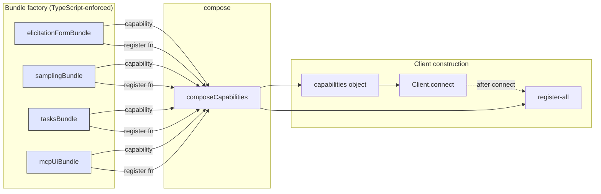

# `CapabilityBundle` factory

> Part of the [§4 proposed architecture](./README.md). Implements [P1 — capability advertisement is a contract](../principles.md). Cross-references: [§1.1 lifecycle](../spec/01-lifecycle.md), [§1.10 capability matrix](../spec/10-capability-matrix.md), [Run registry](./run-registry.md) (which receives the notifications these bundles install).

## §4.7 — `CapabilityBundle` factory (P1)

The single most important refactor: it must be impossible in our architecture to advertise a capability without registering its handler or refusal path. This is an architecture invariant derived from negotiated capability semantics, not a direct quote from the MCP spec. The bundle factory enforces it.

```ts
// lib/mcp/capabilities/bundle.ts
import type { Client } from "@modelcontextprotocol/sdk/client/index.js";
import type { ClientCapabilities } from "@modelcontextprotocol/sdk/types.js";

/**
 * Atomic unit binding a capability declaration to its handler registration.
 *
 * Spec ref: §1.1 (negotiated capabilities). Architecture invariant:
 * bundles bind advertised capability fragments to the handler or refusal
 * path that makes the advertised surface real.
 *
 * INVARIANT: a bundle registers at least one request or notification
 * handler that lights up the methods its `capability` permits, OR the bundle
 * is a pure declaration (no handlers needed; e.g., advertising `roots`
 * without listChanged).
 */
export interface CapabilityBundle {
  /** Fragment merged into the outgoing client capabilities object. */
  readonly capability: Partial<ClientCapabilities>;
  /** Called once after construction, before connect(). */
  register(client: Client): void;
  /** Called on tear-down. Must un-register everything `register` did. */
  unregister(client: Client): void;
}

/**
 * Composer. The intended invocation:
 *
 *   const bundles: CapabilityBundle[] = [
 *     elicitationFormBundle({ requestElicit }),
 *     samplingBundle({ requestSample }),
 *     tasksBundle({ runRegistry }),
 *     mcpUiBundle(),
 *   ];
 *
 *   const { capabilities, registerAll, unregisterAll } = composeCapabilities(bundles);
 *   const client = new Client(impl, { capabilities });
 *   await client.connect(transport);
 *   registerAll(client);
 */
export function composeCapabilities(bundles: CapabilityBundle[]): {
  capabilities: ClientCapabilities;
  registerAll: (client: Client) => void;
  unregisterAll: (client: Client) => void;
} {
  const capabilities: ClientCapabilities = {};
  for (const b of bundles) {
    Object.assign(capabilities, deepMerge(capabilities, b.capability));
  }
  return {
    capabilities,
    registerAll: (c) => bundles.forEach((b) => b.register(c)),
    unregisterAll: (c) => bundles.forEach((b) => b.unregister(c)),
  };
}
```

Concrete bundles (the only place where capability flags appear; consumers cannot bypass this):

```ts
// lib/mcp/capabilities/elicitation.ts
export function elicitationFormBundle(opts: {
  requestElicit: (params: ElicitRequest["params"]) => Promise<ElicitResult>;
}): CapabilityBundle {
  return {
    capability: { elicitation: { form: {} } }, // explicit form-mode support; bare `{}` is SDK back-compat form mode
    register(client) {
      client.setRequestHandler(ElicitRequestSchema, async (req) => {
        return opts.requestElicit(req.params);
      });
    },
    unregister(client) {
      client.removeRequestHandler("elicitation/create");
    },
  };
}

// lib/mcp/capabilities/sampling.ts
export function samplingBundle(opts: {
  requestSample: (params: CreateMessageRequestParams) => Promise<CreateMessageResult>;
}): CapabilityBundle {
  return {
    capability: { sampling: {} },
    register(client) {
      client.setRequestHandler(CreateMessageRequestSchema, async (req) => {
        return opts.requestSample(req.params);
      });
    },
    unregister(client) {
      client.removeRequestHandler("sampling/createMessage");
    },
  };
}

// lib/mcp/capabilities/tasks.ts
export function tasksBundle(opts: {
  runRegistry: RunRegistry;
}): CapabilityBundle {
  return {
    capability: {
      tasks: {
        list: {},
        cancel: {},
        requests: {
          elicitation: { create: {} },
          sampling: { createMessage: {} },
        },
      },
    },
    register(client) {
      client.setNotificationHandler(TaskStatusNotificationSchema, (n) => {
        opts.runRegistry.ingestTaskStatusNotification(n.params);
      });
      client.setNotificationHandler(ProgressNotificationSchema, (n) => {
        opts.runRegistry.ingestProgressNotification(n.params);
      });
    },
    unregister(client) {
      client.removeNotificationHandler("notifications/tasks/status");
      client.removeNotificationHandler("notifications/progress");
    },
  };
}
```

**Why this is better than the current shape.** Today:

```tsx
// route.ts:140-153 — capability declared, handler missing
capabilities: {
  tasks: { list: {}, cancel: {}, requests: { elicitation: { create: {} }, sampling: { createMessage: {} } } },
  elicitation: {},
  sampling: {},
}
```

There's literally nothing in TypeScript or in the SDK preventing this drift. The bundle pattern produces a single handle that `Client` is constructed from; if you forget to add `samplingBundle(...)` you also lose the `sampling: {}` flag, which is the correct outcome.

## §4.26 — Diagram: capability/handler symmetry contract (P1)



If the developer forgets to add `samplingBundle({...})` to the array, both the `sampling: {}` capability and the request handler for `sampling/createMessage` are absent. The Client never advertises something it can't service.

> **See also**
> - The `tasksBundle` registers the handlers that drive [`RunRegistry.ingestTaskStatusNotification` / `ingestProgressNotification`](./run-registry.md).
> - For server-side bundles that route elicitation back to the browser via SSE, see [server-proxy.md "Cross-route/cross-browser dialog routing"](./server-proxy.md#cross-routebrowser-dialog-routing-419).
> - The full `CapabilityBundle` and `composeCapabilities` interfaces are consolidated in [schemas.md](../schemas.md).
