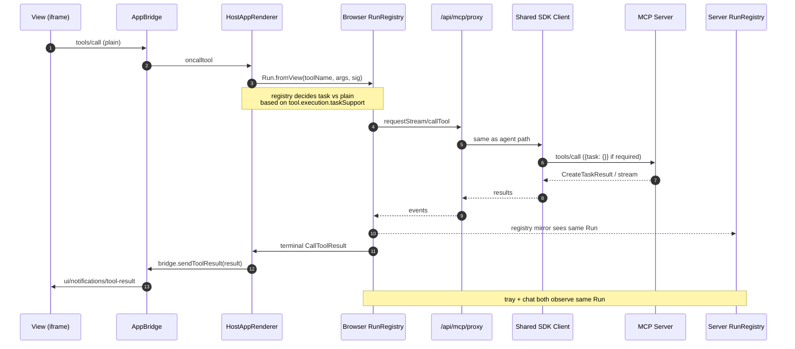
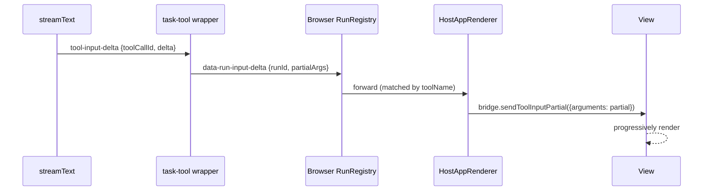

# `HostAppRenderer` and View bridging

> Part of the [§4 proposed architecture](./README.md). Implements [P7 — AppBridge is the smallest legal interface for views](../principles.md) and [P10 — the View MUST be reachable for `tool-input-partial`](../principles.md). Cross-references: [§1.6 MCP Apps (SEP-1865)](../spec/06-mcp-apps.md), [Run registry](./run-registry.md), [view-initiated sequence diagrams](./lifecycle-sequences.md#view-initiated-tool-call), gap #1 and gap #7.

## §4.4 — Sequence: View-initiated tool call

The view never knows whether the call was task-augmented. The host transparently wraps it. P7 satisfied. The full corrected vs current sequence is in [lifecycle-sequences.md](./lifecycle-sequences.md#view-initiated-task-call-corrected).

## `HostAppRenderer` modifications (§4.22.11)

- `oncalltool` becomes UNCONDITIONAL `runRegistry.call(...).waitForResult()`. Drops the `taskRegistry ? ...` gate at `:442-451`.
- Adds `useEffect` that subscribes to "matched run by tool name" and forwards `partialArgs` via `bridge.sendToolInputPartial`. P10.
- On run-cancel, also calls `bridge.sendToolCancelled({reason})`.

## `tool-input-partial` to view (P10, gap #7) (§4.18)

The chat-route, mid-streamText, sees `tool-input-delta` parts (`ai/dist/index.d.ts:2052-2060`). These are emitted *before* `execute` runs. The proposal: when the wrapper is constructed, it accepts a "partial input emitter" that the run uses to emit `data-run-input-delta` parts. The browser's `RunRegistry` consumes those, looks up the corresponding mounted `HostAppRenderer` (by the tool's `_meta.ui.resourceUri`), and forwards via `bridge.sendToolInputPartial({ arguments: partial })`.

Correction from installed types: `dynamicTool` does **not** expose `onInputDelta` or `onInputAvailable`; those callbacks are on provider tool factories, not the generic dynamic tool (`provider-utils/dist/index.d.ts:1195-1224` vs `:1228-1234`). The wrapper therefore needs a separate bridge from AI SDK `tool-input-delta` stream parts, or a provider-tool-factory path if we later adopt one. See [AI-SDK-DYNAMIC-TOOL](../sources.md#ai-sdk-dynamic-tool).

> **See also**
> - The complete sequence including how the host upgrades plain `tools/call` to task path is in [lifecycle-sequences.md "View-initiated task call (corrected)"](./lifecycle-sequences.md#view-initiated-task-call-corrected).
> - The radix replace warning trade-off is in [open-questions.md #4](../open-questions.md).
> - SEP-1865 view-side restrictions (`assertTaskCapability`) are documented in [§1.6](../spec/06-mcp-apps.md).
