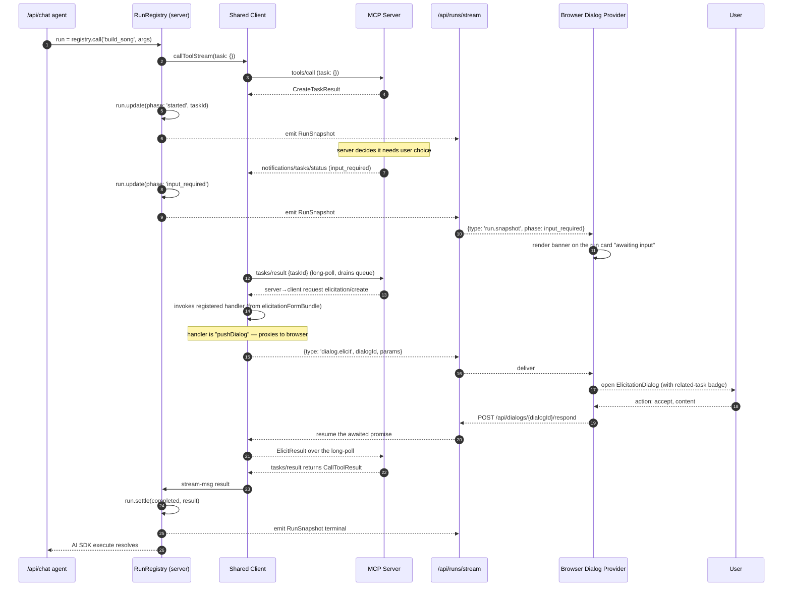
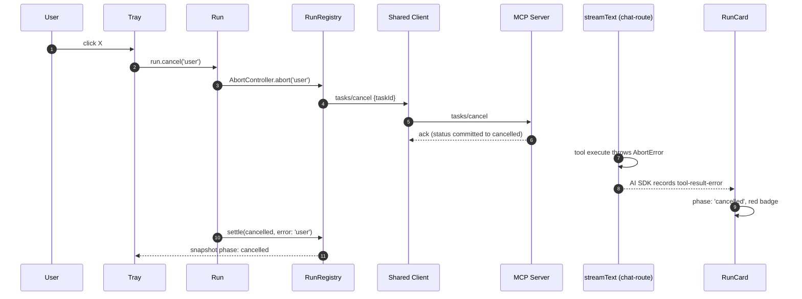

# Lifecycle sequence diagrams

> Part of the [§4 proposed architecture](./README.md). The complete set of sequence diagrams from §4 collected for cross-reference. Each diagram exercises one or more of the [12 first principles](../principles.md) — links inline. Cross-references: [Run abstraction](./run-abstraction.md), [Run registry](./run-registry.md), [server-proxy](./server-proxy.md), [host-app-bridge](./host-app-bridge.md).

## Full agent tool call (§4.3)

The end-to-end happy path under the new architecture: agent invocation through to terminal `CallToolResult`, including elicitation mid-task and SSE delivery to the browser tray. Implements [P3](../principles.md), [P4](../principles.md), [P5](../principles.md), [P11](../principles.md).

```mermaid
sequenceDiagram
    autonumber
    participant U as User
    participant T as Thread (assistant-ui)
    participant C as /api/chat
    participant SR as Server RunRegistry
    participant SC as Shared SDK Client
    participant MS as MCP Server
    participant BR as Browser RunRegistry
    participant BC as Browser SDK Client
    participant PX as /api/mcp/proxy
    participant Tray as TaskTray
    participant View as HostAppRenderer

    U->>T: types prompt
    T->>C: POST /api/chat
    C->>SR: Run.fromAgent(toolName, args, sig)
    SR->>SC: callToolStream({task: {}})  (auto-upgrade)
    SC->>MS: tools/call (params.task = {}, _meta.relatedTask?)
    MS-->>SC: CreateTaskResult { task: {taskId, status: 'working', ttl, ...} }
    SC->>SR: stream-msg taskCreated
    SR->>SR: emit RunEvent('started', runId)
    SR-->>BR: SSE event 'started'  (via /api/runs/stream)
    BR->>Tray: snapshot includes new Run
    BR->>View: forward tool-input-partial as it streams from /api/chat (sse_data part)
    loop polling
        SC->>MS: tasks/get { taskId }
        MS-->>SC: Task { status: 'working', statusMessage: ... }
        SC->>SR: stream-msg taskStatus
        SR->>SR: update(runId, patch)
        SR-->>BR: SSE 'progress'
        BR->>Tray: re-render
        BR->>View: forward partial via host-context (optional)
    end
    Note over MS,SC: server enqueues elicit/sampling, marks task input_required
    MS-->>SC: notifications/tasks/status { status: 'input_required' }
    SC->>MS: tasks/result { taskId } (long-poll, drains queue)
    MS-->>SC: server→client request: elicitation/create
    SC->>BC: route to browser elicitation handler (via SSE re-ingestion or direct since same Client)
    BC-->>U: dialog
    U-->>BC: action: accept, content
    BC-->>SC: ElicitResult
    SC-->>MS: ElicitResult (response over the long-poll)
    MS-->>SC: tasks/result returns the typed CallToolResult
    SC->>SR: stream-msg result
    SR->>SR: settle(runId, {status: 'completed', result})
    SR-->>BR: SSE 'terminal'
    BR->>Tray: row marked completed; lingers 5s
    BR->>View: bridge.sendToolResult(result)
    SR-->>C: AI SDK execute resolves with toModelOutput-shaped value
    C-->>T: streamed assistant turn
```

**Key observations.**

- The shared `Client` (`SC`) is invoked from both `C` and `BR` via `PX`. Capability handler registrations ([§4.7](./capability-bundles.md)) pre-bind elicitation/sampling on `SC` itself; when the server enqueues a request that arrives during `tasks/result`, the SDK dispatches to *the registered handler*, which we route to the browser via `/api/mcp/dialog/stream` (a parallel SSE topic).
- The agent path and tray path observe the same logical `Run`, addressed by `runId`. Across SSE this is not JavaScript reference equality; the server slice is the writer and the browser slice is a read-only mirror of snapshots keyed by the same id.
- No duplicate progress rows. The renderer keys on `runId`.

## View-initiated tool call (§4.4)

The host transparently upgrades a plain `tools/call` from a View into the task path when the underlying tool requires it. Implements [P7](../principles.md). The diagram lives at its canonical home in [`host-app-bridge.md`](./host-app-bridge.md#44--sequence-view-initiated-tool-call) — see "View-initiated task call (corrected)" below for the explicit task-upgrade scenario.

## Elicitation mid-task (§4.23)

Same as the agent-tool-call diagram but zoomed in on the elicitation routing through the bundle factory and the SSE-mediated dialog channel. Implements [P1](../principles.md), [P3](../principles.md).



## Cancel from tray (§4.24)

User cancels a running tool from the tray; the abort flows through the `RunRegistry.AbortController`, calls `tasks/cancel` upstream, and AI SDK's `execute` sees the abort. Implements [P12](../principles.md).



## View-initiated task call (corrected) (§4.25)

The corrected vs current sequence for a View calling a `taskSupport: 'required'` tool. Implements [P7](../principles.md).

```mermaid
sequenceDiagram
    autonumber
    participant V as View
    participant AB as AppBridge
    participant HR as HostAppRenderer
    participant BR as Browser RunRegistry
    participant Px as /api/mcp/proxy
    participant SC as Shared Client
    participant MS as MCP Server
    participant Tray
    participant Card as RunCard (in chat msg)

    V->>AB: tools/call (plain; AppBridge prevents task: {})
    AB->>HR: oncalltool params
    HR->>BR: registry.call(toolName, args, {source: 'view'})
    BR->>Px: requestStream task: {}  ← upgraded by registry
    Px->>SC: forward
    SC->>MS: tools/call (task)
    MS-->>SC: CreateTaskResult
    Note over BR,Tray: tray immediately shows new run
    SC-->>Px-->>BR: stream messages
    BR->>HR: terminal CallToolResult
    HR->>AB: bridge.sendToolResult(result)
    AB->>V: ui/notifications/tool-result
    Note over BR,Card: chat shows the run too IF it's tied to an in-progress message;<br/>standalone view runs don't appear in the chat thread
```

## Refresh-resume (§4.20)

After a browser refresh, the registry reattaches in-flight tasks via `tasks/list`, filtered by the persisted set of "ours" (gap #9). Implements [P3](../principles.md), [§1.9 transport](../spec/09-transport.md).

```mermaid
sequenceDiagram
    autonumber
    participant U as User
    participant B as Browser
    participant SS as sessionStorage
    participant Proxy as /api/mcp/proxy
    participant SC as Shared Client (server)
    participant MS as MCP Server
    participant BR as Browser RunRegistry

    U->>B: refresh
    B->>SS: read mcp:session:<endpoint>
    SS-->>B: sessionId X
    B->>Proxy: connect, headers MCP-Session-Id: X
    Proxy->>SC: (no-op; SC was already up; same upstream session)
    Proxy-->>B: 200 + SSE handshake
    B->>BR: registry.reattachInFlight()
    BR->>Proxy: tasks/list
    Proxy->>SC: tasks/list
    SC->>MS: tasks/list
    MS-->>SC: [task A working, task B working]
    SC-->>Proxy-->>BR: list result
    BR->>BR: filter to ours (sessionStorage taskIds)
    BR->>BR: adopt(taskA), adopt(taskB)
    BR-->>U: tray shows reattached runs
```

> Edge cases (Next.js cold-start session reset, multi-tenant) are tracked in [open-questions.md](../open-questions.md).
