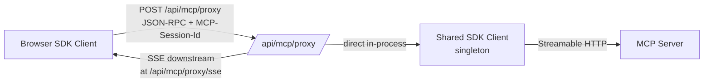

# Server-proxy transport

> Part of the [§4 proposed architecture](./README.md). Implements [P3 — logical operations span the user, not the session](../principles.md). Cross-references: [topology + Option A/B/C trade-off](./topology.md), [§1.9 streamable HTTP transport](../spec/09-transport.md), [open question #1 on session pinning](../open-questions.md), [refresh-resume sequence](./lifecycle-sequences.md#refresh-resume).

## §4.8 — Server-proxy transport



The browser instantiates a `StreamableHTTPClientTransport` pointed at `/api/mcp/proxy`. The proxy route does *not* speak MCP itself — it pipes JSON-RPC frames into the singleton `Client` (server-side) using the lower-level Protocol API (or `client.transport.send(msg)` then awaits responses) and pipes responses + server-initiated requests back over SSE.

Because there is one upstream client, there is one `MCP-Session-Id`. Both the chat-route's tool calls and the browser's view-initiated calls hit the same server peer. The `RunRegistry` in the browser is a **mirror** of the one in the server; the server pushes events, the browser holds local-state-only.

This collapses gap #18.

## Cross-route/browser dialog routing (§4.19)

When the agent (server-side) is mid-task and the server enqueues an `elicitation/create` request, the SDK fires the registered handler on the *server-side* shared client. But the *user* needs to see the dialog. Bridge:

```ts
// lib/mcp/capabilities/elicitation-via-browser.ts
export function elicitationFormBundle_serverSide(opts: {
  pushDialog: (req: ElicitRequestParams) => Promise<ElicitResult>;
}): CapabilityBundle {
  return {
    capability: { elicitation: { form: {} } },
    register(client) {
      client.setRequestHandler(ElicitRequestSchema, async (req) => {
        return opts.pushDialog(req.params); // proxies to browser via SSE
      });
    },
    unregister(client) {
      client.removeRequestHandler("elicitation/create");
    },
  };
}
```

`pushDialog` writes to the per-user SSE stream `/api/runs/stream` with a `dialog/elicit` event carrying a `dialogId`; the browser opens the modal; the user submits; the browser POSTs to `/api/dialogs/{dialogId}/respond`; the server resumes the awaiting promise. The advantage of the server-proxy transport (Option A in [topology.md §4.2](./topology.md)) is that the elicit handler can be on either side — for browser-initiated runs, the elicit handler is local to the browser (no SSE round-trip).

## §4.21 — Decision: how to encode `Run` events on SSE

Two shapes for the SSE body:

```ts
// shape A — JSON-RPC-flavoured
{ type: "run.snapshot", id: "run_xyz", snapshot: RunSnapshot }
{ type: "run.error",    id: "run_xyz", error: {...} }
{ type: "run.terminal", id: "run_xyz", result: CallToolResult }

// shape B — patch-based
{ type: "run.patch", id: "run_xyz", patch: Partial<RunSnapshot> }
```

Recommend **A**, because reference-stable snapshots are easier for `useSyncExternalStore` consumers. Patch-based is bandwidth-leaner but requires careful ordering and re-sync on disconnect.

## Proxy route implementation

The transport collapse, sketched. (Details on touchpoints in [component-touchpoints.md §4.22.4–4.22.5](./component-touchpoints.md).)

```ts
// app/api/mcp/proxy/route.ts
import { NextRequest } from "next/server";
import { sharedClient } from "@/lib/mcp/server-client";

export async function POST(req: NextRequest): Promise<Response> {
  const sessionId = req.headers.get("mcp-session-id") ?? undefined;
  const body = await req.json(); // JSON-RPC frame
  const result = await sharedClient.protocolForward(body, { sessionId });
  return new Response(JSON.stringify(result), {
    status: 200,
    headers: {
      "content-type": "application/json",
      "mcp-session-id": sharedClient.sessionId ?? "",
      "access-control-expose-headers": "mcp-session-id",
    },
  });
}

// SSE downstream is at /api/mcp/proxy/sse for server→client requests
// (sampling/createMessage, elicitation/create, notifications/tasks/status).
```

The tricky part is server→client requests: the server-side Client receives them; the proxy must replay them down the SSE channel to the browser, await a response, and reply upstream. We implement this with a dialog-id correlation — same pattern as the elicitation routing above.

```ts
// app/api/runs/stream/route.ts
export async function GET(req: NextRequest): Promise<Response> {
  const stream = sharedRunRegistry.subscribeSSE(req.signal);
  return new Response(stream, {
    headers: { "content-type": "text/event-stream" },
  });
}
```

> **See also**
> - The full refresh-resume sequence is in [lifecycle-sequences.md](./lifecycle-sequences.md#refresh-resume).
> - The full elicitation-mid-task sequence (which uses this dialog routing end-to-end) is in [lifecycle-sequences.md](./lifecycle-sequences.md#elicitation-mid-task).
> - Edge cases (Next.js cold-start session reset, multi-tenant) are in [open-questions.md](../open-questions.md).
