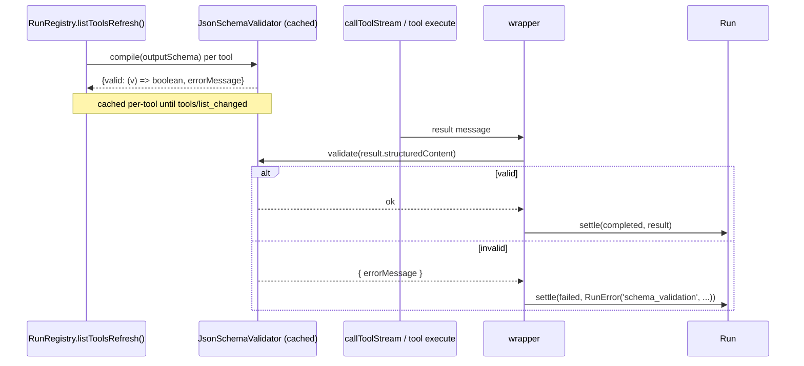
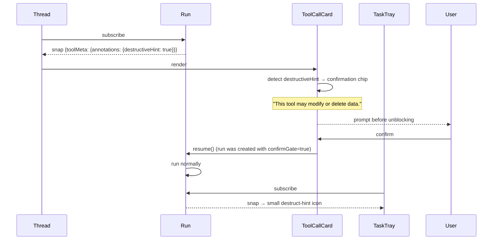

# Tool result modeling

> Part of the [§4 proposed architecture](./README.md). Implements [P4 — tool outputs MUST be modeled per spec](../principles.md), [P6 — tool annotations are first-class UX inputs](../principles.md), and [P8 — schema drives validation; validation drives UI](../principles.md). Cross-references: [§1.2 tools](../spec/02-tools.md), [Run abstraction](./run-abstraction.md), [UI surface](./ui-surface.md), gap #3, gap #4, gap #6.

## §4.10 — Tool result modeling (P4)

```ts
// lib/mcp/runs/tool-result.ts
import type { CallToolResult } from "@modelcontextprotocol/sdk/types.js";
import type { ToolResultOutput } from "@ai-sdk/provider-utils";

/**
 * Convert an MCP CallToolResult into AI SDK's model-visible representation.
 *
 * Behavior aligned with @ai-sdk/mcp's internal mcpToModelOutput
 * (node_modules/@ai-sdk/mcp/dist/index.mjs:1605-1628), with two additions:
 *   - When `isError: true`, we wrap the content in a single text block
 *     prefixed "TOOL ERROR: " so the model treats it as an error message
 *     rather than a successful result. We also stamp our own diagnostic
 *     into provider metadata.
 *   - When `outputSchema` is declared on the tool and validation passed,
 *     we expose `structuredContent` as the canonical machine output for
 *     downstream tool-use chaining.
 *
 * Spec §1.2: CallToolResult.content is the human-or-model-visible blocks.
 *   structuredContent is the schema-validated machine output.
 *   isError indicates the tool call ran but produced an error message.
 */
export function toModelOutputForRun(
  result: CallToolResult,
  toolName: string,
  outputSchemaDeclared: boolean,
): ToolResultOutput {
  if (result.isError) {
    const text = "TOOL ERROR:\n" + extractText(result.content);
    return { type: "content", value: [{ type: "text", text }] };
  }

  if (outputSchemaDeclared && result.structuredContent !== undefined) {
    // Validated upstream in the wrapper. Pass JSON to the model.
    return { type: "json", value: result.structuredContent };
  }

  if (!result.content || result.content.length === 0) {
    return { type: "json", value: result.structuredContent ?? null };
  }

  return {
    type: "content",
    value: result.content.map((block) => {
      if (block.type === "text") return { type: "text", text: block.text };
      if (block.type === "image") return { type: "image-data", data: block.data, mediaType: block.mimeType };
      // resource_link / embedded_resource / audio: model can't natively render;
      // serialize and let the agent reason via JSON.
      return { type: "text", text: JSON.stringify(block) };
    }),
  };
}

function extractText(blocks: CallToolResult["content"] | undefined): string {
  if (!blocks) return "(no content)";
  return blocks.map((b) => (b.type === "text" ? b.text : `[${b.type}]`)).join("\n\n");
}
```

This addresses gap #3 and gap #4. The wrapper now:

1. Reads `outputSchema` from `Tool.outputSchema`, compiles it, validates `structuredContent` on settle, throws `RunError("schema_validation")` on mismatch.
2. Models `isError: true` as an AI SDK content block prefixed `"TOOL ERROR:"`. The model sees it but doesn't interpret it as success.
3. Surfaces tool annotations and icons via `Run.toolMeta` to the renderer.

## §4.11 — Schema validation pipeline



The installed SDK already caches validators after `listTools()` (`client/index.js:539-558`), but `getToolOutputValidator` is private in the TypeScript declaration. App code should not call it directly. The wrapper should compile/cache its own validator from `Tool.outputSchema`, mirroring the SDK behavior instead of depending on private API. See [SDK-PRIVATE-VALIDATOR](../sources.md#sdk-private-validator).

## Tool annotations as UX (P6, gap #6) (§4.13)



Implementation:

```ts
// components/mcp/runs/run-card.tsx
function destructivenessLevel(meta: RunToolMeta): "none" | "destructive" | "open-world" {
  const a = meta.annotations;
  if (!a) return "none";
  if (a.destructiveHint && !a.readOnlyHint) return "destructive";
  if (a.openWorldHint) return "open-world";
  return "none";
}
```

Per [§1.2](../spec/02-tools.md) spec note "Clients should never make tool use decisions based on `ToolAnnotations` received from untrusted servers", this is UX-only, not security; we do NOT prevent the agent from invoking destructive tools, we simply surface a banner and let the user cancel via the tray.

> **See also**
> - The wrapper that calls `toModelOutputForRun` is the per-tool wrapping in [`wrapToolSetWithRuns`](./component-touchpoints.md#4223-libmcprunsai-sdk-adapterts-replaces-libmcptasksai-sdk-adapterts).
> - The `data-run` part that the renderer reads is defined in [UI surface](./ui-surface.md).
