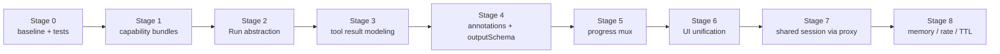
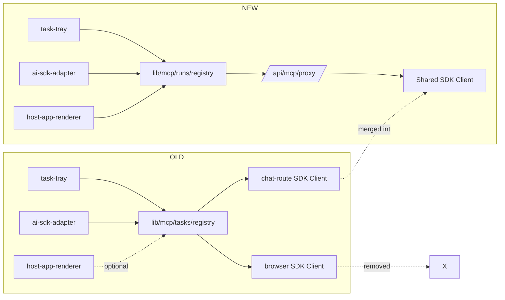

# §5 — Migration plan

> *Editorial note: §5 of the original report. Each stage references the [proposed architecture](./architecture/) component it lands and the [gap-catalog](./current/gap-catalog.md) entry it closes. The test matrix at the end pairs every behavior to the stage that must light it up.*

## §5.1 — Stages

## §5.2 — Stage details

**Stage 1 — capability bundles (low risk).**
- Files: NEW `lib/mcp/capabilities/{bundle,elicitation,sampling,tasks,mcp-ui}.ts`; MODIFY `mcp-client-provider.tsx`, `app/api/chat/route.ts`.
- Backward-compat: zero (purely refactor).
- Risk: low. Net effect: chat-route's missing handlers (gap #2) are now impossible to omit.
- Verification: integration test that connecting a client and calling `listTools()` works; that an artificial `elicitation/create` from a mock server is dispatched; that removing `samplingBundle` makes the client fail to compile (TypeScript test).
- See: [capability-bundles.md](./architecture/capability-bundles.md).

**Stage 2 — Run abstraction (medium risk).**
- Files: NEW `lib/mcp/runs/{run,registry,progress-mux,admission,ring-buffer}.ts`; KEEP `lib/mcp/tasks/{handle,registry}.ts` as deprecation shims that delegate.
- Backward-compat: existing imports continue to work via shim.
- Risk: medium. The shim has to translate `TaskHandle` ↔ `Run` faithfully — `Run.toolMeta` is new and may default to `{ name }`-only when constructed via the legacy path.
- Verification: existing tests pass with shims.
- See: [run-abstraction.md](./architecture/run-abstraction.md), [run-registry.md](./architecture/run-registry.md).

**Stage 3 — tool result modeling.**
- Files: NEW `lib/mcp/runs/tool-result.ts`; MODIFY `wrapToolSetWithRuns` (replaces `wrapToolSetWithTasks`).
- Backward-compat: agent prompts may shift — the model now sees `TOOL ERROR:` prefix on `isError` results. Mostly an improvement but worth a quick eval.
- Risk: medium-high. The `toModelOutput` change can affect agent traces.
- Verification: golden-test a few representative tools.
- See: [tool-result-modeling.md](./architecture/tool-result-modeling.md).

**Stage 4 — annotations + outputSchema.**
- Files: MODIFY wrapper, `RunCard`, `TaskTray`.
- Backward-compat: no functional change for tools that lack annotations.
- Risk: low.
- See: [tool-result-modeling.md "Tool annotations as UX"](./architecture/tool-result-modeling.md#tool-annotations-as-ux-p6-gap-6-413).

**Stage 5 — progress mux.**
- Files: NEW `progress-mux.ts`; MODIFY `RunRegistry` drivers; capability bundles emit `notifications/progress` handler.
- Risk: low (purely additive UX surface).
- See: [run-registry.md "notifications/progress integration"](./architecture/run-registry.md#notificationsprogress-integration-p5-gap-5).

**Stage 6 — UI unification (medium risk).**
- Files: NEW `components/mcp/runs/{run-card,context}.tsx`; MODIFY `task-tray.tsx`; REMOVE `data-task-progress` and `data-task-terminal` parts in favor of a single `data-run`.
- Backward-compat: an in-flight thread when this ships will see legacy parts; the renderer handles both for one transition.
- Risk: medium. The duplicate-rows fix (#13) depends on AI SDK data-part reconciliation by stable `type`/`id`, while assistant-ui only selects the renderer by data `name` after conversion. Verify with `node_modules/ai/dist/index.js:5848-5878` and `node_modules/@assistant-ui/react-ai-sdk/dist/ui/utils/convertMessage.js:147-152`.
- See: [ui-surface.md](./architecture/ui-surface.md).

**Stage 7 — shared session via proxy (high risk).**
- Files: NEW `app/api/mcp/proxy/{route.ts,sse/route.ts}`, `app/api/runs/stream/route.ts`; MODIFY `mcp-client-provider.tsx` (transport URL).
- Backward-compat: the browser stops talking to the upstream MCP server directly; must all flow through the proxy. CORS on the upstream server stops mattering.
- Risk: high. SSE message ordering for server→client requests is subtle. Recommend a phased rollout — keep the direct path as fallback with a feature flag.
- Verification: an integration test with a fake upstream that issues `elicitation/create` mid-task; the dialog must surface in the browser; the user's response must reach the upstream.
- See: [server-proxy.md](./architecture/server-proxy.md).

**Stage 8 — memory/rate/TTL.**
- Files: MODIFY `RunRegistry` to add pruning, admission control; surface TTL warnings in `RunCard`/`Tray`.
- Risk: low.
- See: [run-registry.md "Memory and rate"](./architecture/run-registry.md#memory-and-rate-p9-gaps-19-20).

## §5.3 — Cutover diagram

## §5.4 — Test matrix

| Test | Stage where it must pass |
|---|---|
| Plain (no-task) tool call returns content blocks to model | 0, 3 |
| Task-required tool call upgrades automatically | 0, 2 |
| `elicitation/create` mid-task opens dialog | 0, 1, 2, 7 |
| Dialog cancel returns `action: 'cancel'` (not `decline`) | 0 |
| `sampling/createMessage` requires user consent | 0 |
| `outputSchema` mismatch surfaces as RunError, not silent | 4 |
| Tool with `destructiveHint: true` shows confirmation gate | 4 |
| Tool with `_meta.ui.resourceUri` opens View | 0 |
| View calls `tools/call` for `taskSupport: required` tool succeeds | 2, 7 |
| Tray shows runs initiated by agent | 6, 7 |
| Cancel from tray flips chat card to cancelled | 6 |
| `notifications/progress` updates progress bar on plain calls | 5 |
| Refresh-resume reattaches in-flight tasks | 0, 7 |
| Concurrent run ceiling rejects when exceeded | 8 |
| Terminal runs prune from registry after 5min | 8 |
| TTL warning fires at 80% | 8 |
